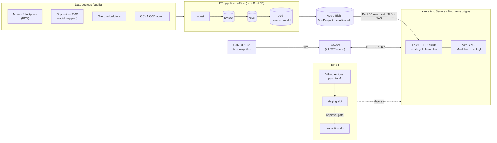

# Architecture — current stack & network

How data flows from public sources to the browser today. The ETL pipeline runs
offline (locally / on demand); the app reads the published `gold` layer live from
blob. See [roadmap.md](roadmap.md) for where this is heading.

**Notes**
- **One app, one origin:** FastAPI serves both `/api` and the built SPA, so there
  are no CORS hops in production.
- **Data path:** the app never bulk-downloads — DuckDB's `azure` extension reads
  GeoParquet with column/row-group pruning and HTTP range requests, authed by a
  read SAS.
- **Trust boundaries:** the browser↔app hop is public HTTPS; the app↔blob hop is
  server-side over TLS with a SAS. Basemap tiles come straight from CARTO/Esri to
  the browser (their own CDN).
- **Deploys** are code-only (build → staging → approval → prod); **data refreshes**
  update `gold` in blob and only need an app restart, no deploy.
