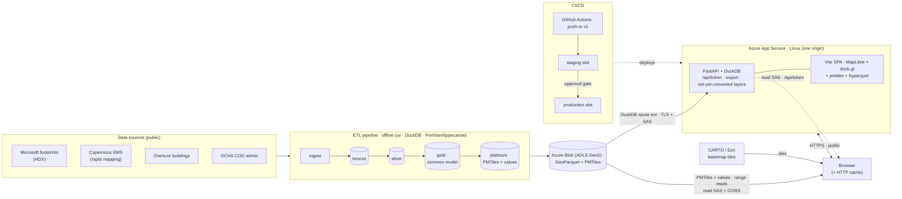

# Architecture — current stack & network

How data flows from public sources to the browser today. The ETL pipeline runs
offline (locally / on demand); the app reads the published `gold` layer live from
blob, and the browser reads the `platinum` serving tier (PMTiles + values) directly
from blob for converted layers ([ADR-0011](decisions/0011-v2-client-side-serving-on-app-service.md)).
See [roadmap.md](roadmap.md) for where this is heading.

**Notes**
- **Two serving paths.** *Legacy:* unconverted layers (H3, agreement) still go
  DuckDB → FastAPI → GeoJSON. *v2 client-side:* converted layers (native footprints,
  the Overture buildings view, the admin choropleth) are read by the **browser
  directly from blob** — geometry as **PMTiles**, choropleth values as a slim
  **parquet** via `hyparquet` — range requests authed by a read SAS from
  `/api/token`, with CORS on the account. An explicit per-layer `LAYER_SERVING`
  registry in the SPA decides `pmtiles` vs endpoint (no silent fallback).
- **Platinum tier.** `pipelines/build_platinum.py` derives PMTiles (Portolan +
  tippecanoe, with a STAC/versions catalog) and a slim `values` parquet from
  `gold`, into `platinum/`. Aggregate tiles/values fall out of gold automatically;
  only native-geometry layers need per-source config.
- **One origin, mostly.** FastAPI still serves `/api` + the SPA, so the app↔browser
  hop is one origin; the **exception** is the browser↔blob reads above (hence CORS).
- **Trust boundaries.** browser↔app and browser↔blob are public HTTPS; app↔blob is
  server-side TLS + SAS. ⚠️ The v2 path makes the **read SAS client-visible** — to be
  hardened to a directory-scoped, short-lived user-delegation SAS (ADR-0011).
- **Deploys** are code-only (build → staging → approval → prod). **Data refreshes**
  update `gold` (app restart, no deploy) and re-run `build_platinum` for `platinum/`.
