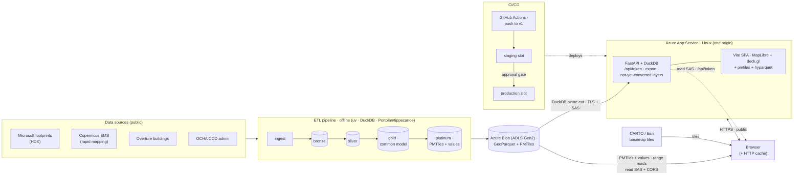

# Architecture — current stack & network

How data flows from public sources to the browser today. The ETL pipeline runs
offline (locally / on demand); the app reads the published `gold` layer live from
blob, and the browser reads the `platinum` serving tier (PMTiles + values) directly
from blob for converted layers ([ADR-0011](decisions/0011-v2-client-side-serving-on-app-service.md)).
See [roadmap.md](roadmap.md) for where this is heading.

```mermaid
flowchart LR
    subgraph sources["Data sources (public)"]
        ms["Microsoft footprints<br/>(HDX)"]
        cems["Copernicus EMS<br/>(rapid mapping)"]
        ovt["Overture buildings"]
        cod["OCHA COD admin"]
    end

    subgraph etl["ETL pipeline · offline (uv · DuckDB · Portolan/tippecanoe)"]
        direction LR
        ingest["ingest"] --> bronze[("bronze")] --> silver[("silver")] --> gold[("gold ·<br/>common model")] --> plat[("platinum ·<br/>PMTiles + values")]
    end

    blob[("Azure Blob (ADLS Gen2) ·<br/>GeoParquet + PMTiles")]

    subgraph app["Azure App Service · Linux (one origin)"]
        api["FastAPI + DuckDB<br/>/api/token · export ·<br/>not-yet-converted layers"]
        spa["Vite SPA · MapLibre + deck.gl<br/>+ pmtiles + hyparquet"]
        api --- spa
    end

    browser["Browser<br/>(+ HTTP cache)"]
    basemap["CARTO / Esri<br/>basemap tiles"]

    sources --> etl --> blob
    blob -->|"DuckDB azure ext · TLS + SAS"| api
    browser <-->|"HTTPS · public"| app
    blob -->|"PMTiles + values · range reads<br/>read SAS + CORS"| browser
    api -.->|"read SAS · /api/token"| browser
    basemap -->|tiles| browser

    subgraph cicd["CI/CD"]
        gh["GitHub Actions ·<br/>push to v1"] --> stg["staging slot"]
        stg -->|"approval gate"| prod["production slot"]
    end
    cicd -.->|deploys| app
```

**Notes**
- **Two serving paths.** *Legacy:* unconverted layers (H3, agreement) still go
  DuckDB → FastAPI → GeoJSON. *v2 client-side:* converted layers (native footprints,
  the Overture buildings view, the admin choropleth) are read by the **browser
  directly from blob** — geometry as **PMTiles**, choropleth values as a slim
  **parquet** via `hyparquet` — range requests authed by a read SAS from
  `/api/token`, with CORS on the account. An explicit per-layer `LAYER_SERVING`
  registry in the SPA decides `pmtiles` vs endpoint (no silent fallback).
- **Platinum tier.** `pipelines/build_platinum.py` derives PMTiles (Portolan +
  tippecanoe, with a STAC/versions catalog) and a slim `values` parquet from
  `gold`, into `platinum/`. Aggregate tiles/values fall out of gold automatically;
  only native-geometry layers need per-source config.
- **One origin, mostly.** FastAPI still serves `/api` + the SPA, so the app↔browser
  hop is one origin; the **exception** is the browser↔blob reads above (hence CORS).
- **Trust boundaries.** browser↔app and browser↔blob are public HTTPS; app↔blob is
  server-side TLS + SAS. ⚠️ The v2 path makes the **read SAS client-visible** — to be
  hardened to a directory-scoped, short-lived user-delegation SAS (ADR-0011).
- **Deploys** are code-only (build → staging → approval → prod). **Data refreshes**
  update `gold` (app restart, no deploy) and re-run `build_platinum` for `platinum/`.

## Flood-label corpora (ML training labels; a separate chain from the damage pipeline)

Two medallion archives of flood-extent labels live in the `global` container of the **dev**
account (`imb0chd0dev`), not under this repo's `projects/` tree: they are general corpora,
not event-scoped project data (ADR-0029). Neither has been promoted to prod (ADR-0014).

| corpus | layers on blob | gold schema | code |
|---|---|---|---|
| Copernicus EMS Rapid Mapping flood activations, 2012– | `global/copernicus_ems/flood/{bronze,silver,gold,platinum}/` | **v1**: one flood `geometry` + `valid_geometry` per label set; `area_km2`, `sensor`; no `label_source`, no water geometry, no `sensor_class` | `pipelines/cems_flood/` (on `v1`) |
| UNOSAT flood & cyclone products catalogued on HDX, 2014– | `global/unosat/{bronze,silver,gold}/` | **v2**: `geom_water` / `geom_flood` / `geom_possible` / `geom_valid`, `label_source`, `sensor_class`; 181 of 186 events built | `pipelines/unosat/`, `src/gie/unosat/` — PR #128 (bronze) and #132 (silver + gold), unmerged |

- **Combined display platinum.** `global/flood_labels/platinum/` is one Portolan catalog over
  BOTH golds — collections `water` (UNOSAT water at acquisition), `flood` (every CEMS extent +
  UNOSAT flood where the source separated it), `valid-masks`, `label-index`; PMTiles capped at
  z10/z10/z9 — built by `pipelines/flood_labels/platinum.py` + `src/gie/flood_labels/` (PR #137,
  unmerged). It is **display-only**: simplified geometry, a thin harmonised index, and nothing
  invented to make the two schemas match (CEMS `sensor_class` and water area stay null).
  Analysis and any ML label reader must read gold, never this catalog.
- **Page.** `pages/flood-labels/` (live on `v1` since 2026-09-25, #138) reads that catalog in the
  browser through the shared token issuer: app `flood-labels` → read-only, 24 h, directory-scoped
  SAS on `global/flood_labels/platinum`. The earlier CEMS-only viewer `pages/cems-flood-labels/`
  (app `cems-flood-labels`, catalog `global/copernicus_ems/flood/platinum/`) is kept until the
  combined page is confirmed. To retire it: delete the page directory and its landing card, drop
  the `cems-flood-labels` entry from `token-issuer/function_app.py`, redeploy with
  `token-issuer/deploy-zip.sh`, and leave the blob catalog in place (its `versions.json` is a
  citable record).
- **Decision records.** CEMS bronze/silver: ADR-0029 (on `v1`). UNOSAT bronze, gold v2, audit
  scope, geometry method, gold v3 (rasterise), and the combined platinum are ADRs 0033–0038 on
  the unmerged branches above; `v1` has since taken 0033 and 0034 (#127), so they must be
  renumbered when #128/#132/#137 merge.
