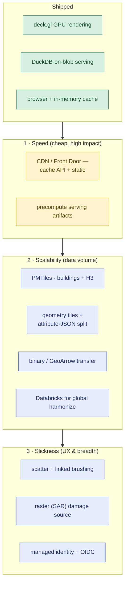

# Roadmap — speed, scale & slickness

Where the [current stack](architecture.md) can go as audience and data volume
grow. Phased so each step is cheap relative to its payoff; nothing here is built
yet beyond what's marked *shipped*. (This is the working source for a future
ADR-0008.)

**1 · Speed** — mostly config, no data-model change. A CDN (Azure Front Door) in
front caches the deterministic, read-only API + static SPA: cold ~15 s → instant
for everyone, and the app stops absorbing concurrency. Precomputing serving
artifacts pulls DuckDB off the hot path.

**2 · Scalability** — the data-volume answer. PMTiles (`tippecanoe` → blob, range
requests, no tile server) so the client only fetches tiles in view; splitting
static geometry tiles from a tiny dynamic attribute payload keeps per-source/
per-metric styling instant; binary/GeoArrow shrinks point transfers. Databricks
only if harmonization outgrows the single-DuckDB pipeline (e.g. global scale).

**3 · Slickness** — linked scatter/brushing for source comparison, the raster
(SAR) damage source, and the managed-identity/OIDC auth upgrade (removes the
stored SAS / publish-profile secrets).

**Phasing:** CDN now (soft launch) → PMTiles + geometry/attribute split when data
grows past a single city → binary + Front Door tuning at real/global traffic.
