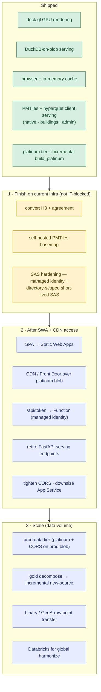

# Roadmap — speed, scale & slickness

Where the [current stack](architecture.md) goes as audience and data volume grow.
**v2 client-side serving** (PMTiles + hyparquet,
[ADR-0011](decisions/0011-v2-client-side-serving-on-app-service.md)) is now shipping
on the existing App Service. The phases below finish that migration on today's infra,
then lay out what changes once IT grants **Static Web Apps + CDN**.

**1 · Finish on current infra** — none of this needs IT. Convert the last two layers
(H3 needs `h3_cell_to_boundary` geometry-gen + its own slim values parquet; agreement
reuses the buildings tile). Self-host the basemap as PMTiles (Overture via planetiler,
or Protomaps) to drop the hosted-CARTO dependency. **Harden the SAS**: give the App
Service a managed identity (*Storage Blob Data Reader*) and have `/api/token` mint a
**directory-scoped, short-lived user-delegation SAS** to just
`projects/ds-geospatial-impact-estimates/platinum/` — the account is ADLS Gen2, so
directory scoping works. This removes the long-lived client-visible SAS *before* any
public exposure.

**2 · After SWA + CDN access** — the migration to Maxym's end-state topology, now that
the data tier (PMTiles + values in blob) is already in the right shape:
- **SPA → Static Web Apps:** move `web/dist` off the FastAPI `StaticFiles` mount to
  SWA global static hosting (edge-served, custom domain).
- **CDN / Front Door over `platinum/`:** edge-cache the PMTiles + values parquet
  (immutable, versioned via Portolan `versions.json` → long cache, bust on version);
  point the client `base_url` at the CDN. Removes per-request blob egress + latency.
- **`/api/token` → Function:** relocate the token minting into an SWA-integrated
  Azure Function using managed identity (same logic as phase 1, just hosted there).
- **Retire FastAPI serving endpoints:** once H3 + agreement are converted, the
  GeoJSON/JSON routes (`/api/native|buildings|common/*|agreement`) are dead; only
  `/api/token` (Function) + `/api/export` remain. The always-on App Service Plan can
  be **downsized or retired**.
- **Tighten CORS** from `*` to the SWA origin, set at the CDN layer.

**3 · Scale** — replicate `platinum/` + CORS to the **prod blob** so prod reads prod
(the dev/prod data split), fronted by the CDN. Decompose the monolithic gold so a new
source is incremental end-to-end. Binary/GeoArrow shrinks point transfers; Databricks
only if harmonization outgrows the single-DuckDB pipeline (global scale).

**Phasing:** finish the layers + SAS hardening now → SWA/CDN migration when access
lands → prod data tier + scale work at real/global traffic.
