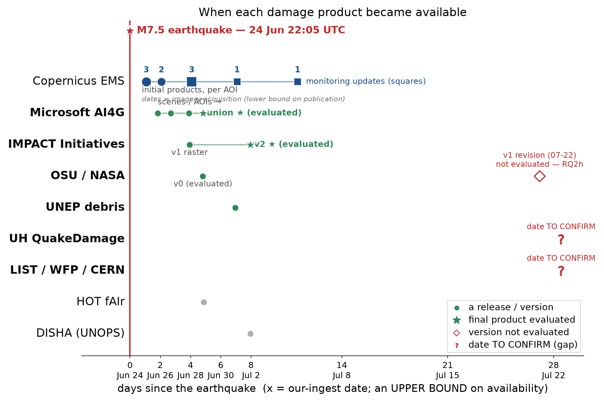

## What arrived, and where each product looked

::: {.cols}
::: {.col style="flex:1.35"}
{style="max-height:600px"}
:::
::: {.col style="display:flex;flex-direction:column;justify-content:center"}

::: {.takeaway style="font-size:0.66em"}
Everything landed within about eight days. But analysed extents span **three orders of
magnitude**, so the like-for-like arena is the **red core region (61 km²)** where all
five extents and the expert reference coincide.
:::

::: {.tiny style="font-size:0.5em"}
M7.5, coastal Venezuela, 24 June 2026; we evaluated the 6 of 8 products that published an
analysed extent; numbers frozen to the 2026-07-15 snapshot. Timeline x-axis is our ingest
date, an upper bound on availability; UH and LIST provider
release dates still to confirm.
:::
:::
:::

## Three questions

Eight products arrived for the same earthquake within days of each other. A coordinator
receiving several of them in the same week has no established way to decide which to
trust, for what purpose, or at what spatial scale. So we asked:

::: {.smaller}
- **Can a responder act on a single flagged building?**
- **Do they rank neighbourhoods well enough to prioritise?**
- **What is the sensible way to use them** in the next event?
:::

## Performance metrics by model: building-level analysis

{.r-stretch}

## Precision & recall: single products vs combinations

{.r-stretch}

## Can they rank the worst-hit neighbourhoods?

{.r-stretch}

::: {.takeaway style="font-size:0.66em"}
Yes: products can support neighbourhood-level prioritisation. In the core region every
product ranks the worst-hit cells far better than chance (ρ 0.48–0.74, n = 133 cells,
all p < 10⁻⁸). As delivered the correlations are much lower (−0.09 to 0.58), and UH is
statistically indistinguishable from zero.
:::

## Three questions, three answers

::: {.smaller}
1. **Can a responder act on a single flagged building?** **No.** Precision runs
   0.05–0.09 even in the damage-dense core region: most flags have nothing wrong
   underneath them.
2. **Do they rank neighbourhoods well enough to prioritise?** **Yes, with a condition.**
   Where the damage zone is known and confined (our core region), most products show
   real prioritisation value (ρ 0.48–0.74); as delivered the signal is much weaker
   (ρ −0.09 to 0.58).
3. **What is the sensible way to use them in the next event?** **Still open.** The
   promising lines:
   - **Combine products.** Counting agreement between independent products roughly
     doubled the accuracy of the best single one here, with no reference data needed.
   - **Match the operating point to the moment.** Different stages of a response may
     favour precision or coverage differently; field and first-responder feedback
     should establish where and when higher precision beats broader coverage (open).
   - **Improve the models.** Evaluations like this one show providers where the
     failures are.
:::

