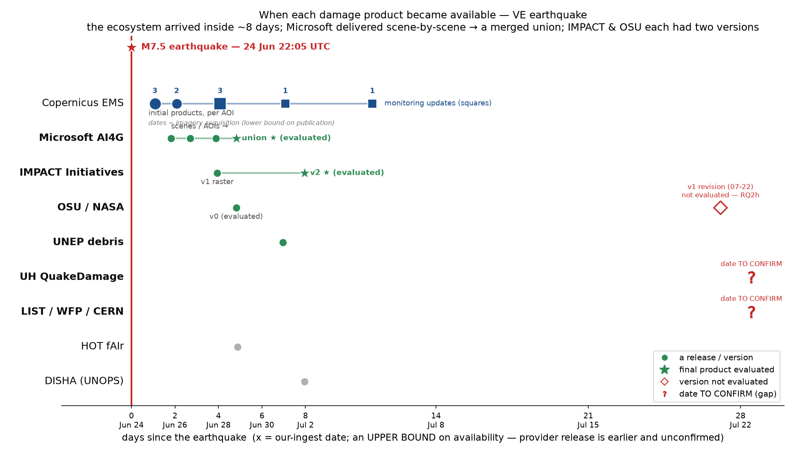

```{python}
#| include: false
import pandas as pd
from pathlib import Path
A = Path("artefacts")
def tbl(p, **kw):
    return pd.read_csv(A / p, **kw)
```

::: {.callout-note}
**What this document is.** A lazy, living register: each section states what we currently
believe, imports the evidence straight from the `artefacts/` CSVs/figures (no re-computation),
and logs flags/open questions. Per-RQ process detail lives in each `NOTES.md`; the paper
outline is `paper_outline.md`. When conclusions settle, prose graduates from here to the paper.
:::

::: {.callout-tip}
**Terminology, fixed.** "**k-of-4 vote**" always names a *rule*: flag a building when ≥k of
the four AOI products (Microsoft, IMPACT v2, OSU, UH) flag it. It is never a performance
number. Performance is always written as percentages or named metrics (precision, recall).
"Precision floor" = precision measured against CEMS, which under-enumerates lighter damage
(RQ2e), so true precision is at least this value.
**Terminology change (2026-07-21):** what this register historically calls the "modality
floor" (the single-product precision plateau no tuning rises above) is renamed **"modality
ceiling"** in the manuscript (v2) — geometrically the better word: it caps single products
from *above*, whereas a precision *floor* sits *below* the truth. Same concept, register
sections keep the old name.
:::

# Ground rules (RQ0) — settled

**How the three references are used (CANONICAL — resolves the recurring "which reference,
where, why" confusion; MapSwipe vs ChatMap especially).**

| Reference | Geometry | Role | Used for |
|---|---|---|---|
| **CEMS** (expert) | building-level points | **PRIMARY** | all headline precision/recall (r = 10 m) — the default basis unless labelled otherwise |
| **ChatMap** (field) | building-level points | strengthen **or** critique | (a) *unioned* with CEMS → a fuller building-level reference; (b) held *separate* → exposes CEMS's own grade-blindness (RQ2e grade slope) |
| **MapSwipe** (crowd) | ~50 m hex-cell votes | **lens, not a reference** | crowd-adjusted precision (floor→interval), west-cluster adjudication (RQ7), evaluating CEMS |

- **CEMS-only is the headline default — now justified, not just convenient.** RQ2k: adding
  ChatMap (CEMS ∪ ChatMap) moves precision by **≤0.006 absolute** and recall by **≤0.026**
  across all six products — immaterial to every conclusion. So headline numbers stay
  CEMS-only and literature-comparable.
- **Reporting style where useful:** `{metric}: {CEMS-only} ({CEMS∪ChatMap})` — primary value,
  strengthened value in parentheses. Not mandatory everywhere (verbose); used where the gap
  carries signal.
- **ChatMap's dual role is deliberate:** *unioned* (strengthen precision/recall, small) vs
  *separate* (the "CEMS is half-blind" critique, RQ2e) — different questions, different
  handling. Never conflate them.
- **MapSwipe is never a headline metric.** Its ~50 m cell verdicts, seeded from AI flags, make
  it an UPPER-estimate lens (crowd-adjusted precision) and a CEMS-completeness probe — not a
  building-level reference, and not usable to score the geography null model (would be circular,
  since the crowd only saw AI-flagged spots; RQ2n).


**Scoring basis:** dual-anchored pairwise-native matching on immutable silver snapshots —
CEMS stays bare points/blocks, each product keeps its native footprints; r = 10 m primary,
{5, 20} sensitivity. The viewer's gold/Overture model is *disqualified for scoring* (snap
drops/collapses CEMS itself) but is legitimately used to **construct** ensemble predictors
(RQ5) and covariates (RQ3b) — construction basis ≠ scoring basis, stated wherever used.

**Ground truth:** CEMS EMSR884 (trained-analyst VHR interpretation), truth *within its
analysed extent*, with the coverage and visibility bounds handled explicitly —
**latest monitoring product per AOI only** (`cems_points()` filters `is_latest`; see the
flag-#13 incident).

**Data freeze — 2026-07-15.** Sources and versions as of this date (six members: MS,
IMPACT v2, OSU, UH, LIST, UNEP; references: CEMS latest-monitoring, MapSwipe bronze,
ChatMap 415). All tables in this register were re-pinned to the frozen basis in one batch
(`artefacts/_run_freeze_batch.sh`, 13 scripts, all green); pre-freeze values are archived in
`artefacts/_prefreeze_backup/`. The re-pin moved **no metric by more than ±0.002** —
the double-counted CEMS points were co-located duplicates, so ratios were never affected.
Products updating after this date go to future work.

**Freeze amendment — OSU v1 pin (2026-07-27).** OSU delivered a revised v1 on 2026-07-22
(69,431 flags vs v0's 58,870; confidence tiers; ~8% wider extent), a week after the
freeze, and the served gold/platinum moved to it (dashboard basis — deliberately left
untouched). USER DECISION: the paper scores **v0**, the delivery available during the
response. Mechanism: silver is version-partitioned, so `gie_paper.building_flags()` now
re-derives `osu_dmg` from `version=v0` by id — all ten gold-reading scripts go through it.
**Verification: re-running rq5b under the pin reproduces the frozen CSV exactly.** The
v0-vs-v1 comparison is RQ2h. Two artefacts had been re-run on v1 gold in the interim
(rq2_chatmap_recall, rq8) and are re-pinned; the RQ3 family reads no gold flags (native
silver, still v0) and was never affected.

**Freeze freshness check — reference side (2026-07-20, freeze holds).** Live MapSwipe API
and HDX compared against bronze: ChatMap field points unchanged (415, last modified
2026-07-11, pre-pull); crowd votes accrued +4% (80,005→83,188) but tasks at the ≥4-vote
adjudication bar grew only +0.7% (8,941→9,007), all in three still-open second-round
projects; the west-adjudication project (Catia La Mar 1, 20,354 votes) is FINISHED and
identical to bronze; no new projects or areas. **Watch item:** project 3248 (*Catia La Mar
round 2*) is a fresh crowd pass over the contested west zone but sits PAUSED at ~1 vote/task
— if completed it would independently re-adjudicate the 71% rejection; re-check before
submission. **2026-08-07: watch item CLOSED** — 3248 completed 2026-08-05 (54,305 votes,
728 contributors) and is analysed as a post-freeze replication in RQ7c below. The frozen
numbers are untouched: 3248 landed as an additive bronze partition and all pooled loaders
now pin to the frozen rounds (`gie_paper.MAPSWIPE_POSTFREEZE`; pooled verdict series
verified md5-identical before/after ingest). One nuance: round 2's redesigned answer
options cannot re-test the 71% *active rejection* (no "No" button); what it re-tests, and
replicates, is the confirmation side.

**Robustness — per-building cloud visibility (checked 2026-07-20, negligible).** Microsoft's
merged file carries `unknown_pct`, the fraction of each building's buffer that was
cloud/no-data; our harmonize drops it, and MS's valid-area mask does *not* excise cloud
holes (99.4% of majority-obscured buildings sit inside it). So per-building visibility was
genuinely unaccounted for — and it doesn't matter: 3.6% of buildings are majority-obscured,
obscuration is *lower* on flagged buildings (0.4%) than intact ones (4.0%; the model
abstains under cloud), precision is unchanged at 0.089 under any visibility filter, and
exactly 1 of 794 missed CEMS points sits on an obscured building. Cloud also does *not*
explain the west false-positive cluster — the single-scene west is the most cloud-free zone
(2.8% obscured vs 5.2% east). Script: `RQ0-matching-basis/scripts/rq0_cloud_unknown_robustness.py`;
interpretation caveat (a conditioning artifact in the CSV's recall column) in that folder's
NOTES.md. No other product publishes a per-building visibility field, so the check is only
possible for MS — a point for the auditability discussion.

```{python}
#| fig-cap: "How dual-anchor matching works. Left: a product is only scored where it AND CEMS both looked. Middle: recall anchors on CEMS — each CEMS damage point asks 'is a product flag within r=10 m of me?'. Right: precision anchors on the product — each flagged building asks 'is a CEMS damage point within r of me?'. Because each metric has its own denominator, no count of true negatives (the huge undamaged background) is ever needed."
import matplotlib.pyplot as plt
import matplotlib.patches as mp
import numpy as np
from shapely.geometry import Point

R = 0.16  # match radius (schematic)
fig, ax = plt.subplots(1, 3, figsize=(13, 5.1))

# ---- panel 0: the scoring region -------------------------------------------
a0 = ax[0]
c1, c2 = Point(-0.28, 0).buffer(0.75), Point(0.28, 0).buffer(0.75)
inter = c1.intersection(c2)
a0.add_patch(mp.Polygon(np.asarray(inter.exterior.coords), closed=True,
                        fc="#c8e6c9", ec="none", zorder=1))
for c, col, lab, xy in ((c1, "tab:blue", "CEMS analysed extent", (-0.75, 0.62)),
                        (c2, "tab:orange", "product AOI", (0.42, 0.62))):
    a0.add_patch(mp.Polygon(np.asarray(c.exterior.coords), closed=True,
                            fc="none", ec=col, lw=2, zorder=2))
    a0.annotate(lab, xy, fontsize=9, color=col)
a0.annotate("scored HERE only", (0, -0.05), fontsize=10, ha="center", weight="bold",
            color="#2e7d32")
a0.set_title("1 · where scoring happens", fontsize=10)

# ---- panel 1: recall (anchor = CEMS points) ---------------------------------
a1 = ax[1]
cems_pts = [(-0.45, 0.3, True), (0.15, -0.25, True), (0.45, 0.42, False)]
prod_pts = [(-0.38, 0.22), (0.05, -0.32), (-0.6, -0.5), (0.62, -0.15)]
for x, y in prod_pts:
    a1.scatter(x, y, marker="s", s=70, c="tab:orange", zorder=3)
for x, y, hit in cems_pts:
    a1.add_patch(mp.Circle((x, y), R, fc="none", ec="grey", ls="--", zorder=2))
    a1.scatter(x, y, marker="*", s=180, c="k", zorder=4)
    a1.annotate("TP" if hit else "FN (missed)", (x + 0.05, y + 0.13), fontsize=9,
                color="#2e7d32" if hit else "#c62828", weight="bold")
a1.set_title("2 · RECALL — anchor on each CEMS point:\n“flag within r?”  → TP / FN", fontsize=10)
a1.annotate("denominator = CEMS points", (0, -0.85), ha="center", fontsize=9, style="italic")

# ---- panel 2: precision (anchor = product flags) ----------------------------
a2 = ax[2]
prod2 = [(-0.45, 0.32, True), (0.1, -0.2, True), (0.5, 0.45, False), (-0.15, -0.6, False)]
cems2 = [(-0.36, 0.25), (0.2, -0.14)]
for x, y in cems2:
    a2.scatter(x, y, marker="*", s=180, c="k", zorder=4)
for x, y, hit in prod2:
    a2.add_patch(mp.Circle((x, y), R, fc="none", ec="grey", ls="--", zorder=2))
    a2.scatter(x, y, marker="s", s=70, c="tab:orange", zorder=3)
    a2.annotate("TP" if hit else "FP (false alarm)", (x + 0.05, y + 0.13), fontsize=9,
                color="#2e7d32" if hit else "#c62828", weight="bold")
a2.set_title("3 · PRECISION — anchor on each product flag:\n“CEMS point within r?”  → TP / FP", fontsize=10)
a2.annotate("denominator = flagged buildings", (0, -0.85), ha="center", fontsize=9, style="italic")

for a in ax:
    a.set_xlim(-1.05, 1.05); a.set_ylim(-1.0, 0.9)
    a.set_aspect("equal"); a.set_xticks([]); a.set_yticks([])
h = [plt.Line2D([], [], marker="*", ls="", ms=13, c="k", label="CEMS damage point"),
     plt.Line2D([], [], marker="s", ls="", ms=8, c="tab:orange", label="product-flagged building"),
     plt.Line2D([], [], ls="--", c="grey", label="match radius r (10 m)")]
fig.legend(handles=h, loc="lower center", ncol=3, frameon=False, fontsize=9)
fig.tight_layout(rect=(0, 0.07, 1, 0.97))
plt.show()
```

# RQ1 — coarse blocks: products agree with CEMS on *where*

All products concentrate damage inside CEMS coarse blocks far above random. SAR products
(IMPACT v2, OSU) track the CEMS block severity gradient (ρ ≈ 0.5); Microsoft does not
(ρ ≈ 0.08 — but its region is Caraballeda only). **Confidence: high** on concentration;
lift numbers are *not* cross-product comparable (different regions) until re-scored on a
common region — partially superseded by RQ4/RQ5 common-region work.

**RQ3 update (2026-07-28, clean res-7 rank scatter, all six products).** The messy
block-gradient ρ's above (MS 0.08, different regions/resolutions) are superseded for the
deck/paper by a clean res-7 test in Caraballeda (`scripts/rq3_rank_scatter_all.py`,
per-cell CEMS damage count vs product flag count). **All six products rank neighbourhoods
about equally well: ρ = 0.77–0.83** (MS 0.81, IMPACT 0.80, OSU 0.81, UH 0.80, LIST 0.83,
UNEP 0.77) — ranking is UNIVERSAL, not cherry-picked. Caveats to hold: (1) dense zone only —
full-region ρ ≈ 0.5–0.6; (2) coarse ~5 km² scale, degrades finer; (3) NOT yet checked vs the
geography null model at area level (it plausibly ranks areas equally well — the damage gradient
IS the coast/shaking gradient), so present as "products' most useful capability," not a clean
win over the free baseline. Figs: rq3_priority_map, rq3_rank_scatter_all.

# RQ2 — building-level: high recall, precision structurally capped

```{python}
tbl("RQ2-cems-footprint-points/rq2_points_summary.csv")
```

Products flag 5–26× more buildings than CEMS has points, so precision (0.05–0.12) is capped
by CEMS point density and **must not be read as "88–95% wrong"**: it conflates product FP with
CEMS under-enumeration. Headline should be recall + over-detection ratio. **Confidence: high**
(the framing), **medium** (absolute numbers — Caraballeda-weighted).

# RQ3 — prioritization survives the noise

At res 7 (~5 km², triage scale) Microsoft and OSU place ~80–85% of the top-20 worst-hit cells
correctly (ρ ≈ 0.57) despite 6–26× over-detection. Skill improves res 8 → res 7: the
over-detection averages out at operational scale. **Confidence: high.**


# RQ3b — the error is structured, but structured along the earthquake

```{python}
t = tbl("RQ3-prioritization-error-structure/rq3_error_structure_summary.csv")
t[(t.res == 8)]
```

- The originally-proposed `bias_rho` was mechanically confounded — **retired**, do not report.
- Raw GLM shows huge density coefficients — **mechanical exposure**, they vanish under an
  offset for building stock. The honest spec is `exposure`.
- After exposure adjustment: residual over-detection is spatially clumped (Moran's I 0.45–0.60,
  p = .001 everywhere) but follows **the severity gradient** (toward coast, up with MMI) — the
  benign kind of structure that preserves ranking; the rank-corrupting kind (density/urban form)
  is ruled out. **Confidence: medium-high** — covariates explain ≤ 0.27 of residual variance;
  the unexplained clumping (SAR swath/terrain candidates) is an open item.
- **Microsoft exception:** its error is one hard cluster at the *west end of the Caraballeda
  strip*, unexplained by covariates (R² = 0.01, I = 0.60). Likely the external group's "high FP
  sub-region" report, found independently. → named investigation, open.


**Per-CEMS-area split (addendum, 2026-07-08)** — Moran's I of exposure-adjusted residuals by
analysed area (was previously pooled across areas for IMPACT/OSU):

```{python}
tbl("RQ3-prioritization-error-structure/rq3b_per_area_moran.csv").pivot(
    index="area", columns="product", values="moran_I")
```

- Within-area clustering is significant in every damage-bearing area → the pooled result was
  not a pooling artifact. But pooled I exceeds within-area I for IMPACT (0.45 vs 0.30) and OSU
  (0.51 vs 0.39): part of the pooled signal is *between-area* mean shifts (swath/regional
  effects). Two scales of structure — report both.
- **Where IMPACT/OSU go quiet (Santa Cruz, ~1% flags), their sparse errors are clean noise**
  (I ≈ 0.05, ns) — the desirable behaviour.
- **UH's inland over-flagging is clumped** (Santa Cruz I = 0.33, p = .001 at 27.5% flags) —
  systematic, spatially coherent model failure, strengthening RQ2c.
- OSU San Felipe: 1.1% flagged yet I = 0.40 — its few FPs cluster somewhere specific
  (Puerto Cabello port/industrial?). Candidate mini-investigation.

::: {.callout-warning}
**Standing attribution flag (applies to RQ2, RQ3b, RQ5):** "over-detection" concentrated where
damage is worst could partly be CEMS point incompleteness peaking there. The tests detect
*structure*; they cannot assign it to product FP vs CEMS FN. This does not weaken the
prioritization conclusion (holds either way) but bounds every precision claim.
:::

## RQ3c — spatial error statistics as a product-reliability map (2026-07-15)

User question: can Moran's I tell us *where* to trust a product? Yes — with two conditions.
First, the intuition inverts: **random residuals are the good case** (noise averages out;
that is the RQ3 thesis), clustered residuals are the warning. Second, structure alone is
not a verdict — it needs the error *rate* and the *damage context*: in a damage zone,
clustered over-flagging is the benign severity-aligned pattern (RQ3b); in a near-zero-damage
control area, the same signature is systematic failure. The resulting per-(product × area)
diagnosis, assembled entirely from existing results (RQ2c rates + RQ3b per-area Moran):

```{python}
tbl("RQ3-prioritization-error-structure/rq3c_reliability_map.csv")[
    ["product", "area", "n_cems", "flag_pct", "moran_I", "p", "diagnosis"]]
```

- Cleanly separates behaviours the pooled numbers blur: IMPACT is *trustworthy-silent* in
  Santa Cruz/San Felipe but **systematically failing in Caracas** (8.5% clustered flags
  where CEMS found ~nothing — a sharper indictment than RQ2c's rate-only view); OSU is
  quiet-with-small-pockets; UH fails systematically in two of its four areas.
- Operational reading: a coordinator could be handed this as a **per-zone trust table** —
  and it suggests *reliability-aware fusion* (weight each product's vote by its local
  diagnosis) as the natural upgrade to flat k-of-6 voting. Future work / discussion
  material, not implemented.
- Caveats: the "no-damage zone" premise inherits standing flag #1 (CEMS completeness in
  Caracas/Santa Cruz); small areas have low permutation power (an ns Moran's I in Moron's
  49 cells is weak evidence of randomness).

## RQ3d — LISA: the spatially-varying reliability surface (2026-07-15)

The continuous version of RQ3c: **Local Moran's I** classifies every res-8 cell of every
product's region as HH (local over-flagging clump — distrust flags here), LL (local blind
spot — distrust silence here), outlier, or locally-random (grey — trustworthy noise).
999 permutations per cell, p<0.05 uncorrected: interpret the clumps, not single cells.

```{python}
tbl("RQ3-prioritization-error-structure/rq3d_lisa_summary.csv")
```


- **78–86% of every product's territory is locally-random** — failures are not diffuse but
  concentrated in identifiable pockets, which is what makes a reliability *layer* feasible
  at all.
- The known pathologies fall out automatically: MS's west-Caraballeda cluster (found by eye
  in RQ3b) is its HH clump; UH's Santa Cruz hallucination is its; IMPACT shows an LL blind-
  spot clump (under-flagging) it had no other diagnostic for.
- Per-cell CSVs written per product (`rq3d_lisa_<product>.csv`) — directly ingestible as a
  partner-facing "which products to trust here" overlay, and the natural gating input for
  reliability-aware fusion (drop a product's vote inside its own HH cells — untested).
- Limits: surface exists only where CEMS looked; retrospective (this event); res-8 coarse;
  per-cell p-values uncorrected (standard LISA caveat).

## RQ3e — NEGATIVE RESULT: reference-free spatial statistics do NOT predict reliability

User hypothesis (2026-07-15): if spatial signatures of the flags *themselves* (no reference
needed) correlate with CEMS-measured performance, reliability could be extrapolated to
areas CEMS never covered. Tested across 15 (product × area) pairs — three reference-free
predictors (flag rate, Moran's I of the raw flag-rate field, peer-agreement share) vs
CEMS-measured precision:

```{python}
tbl("RQ3-prioritization-error-structure/rq3e_reference_free.csv")
```

- **All correlations weak and non-significant** (ρ = +0.09…+0.29, p ≥ 0.29). The
  reliability-diagnosing statistics of RQ3b/3d work *because* they are residuals against
  CEMS; remove the reference and the signal goes with it.
- Two structural reasons, both findings in their own right: (1) **pathological flags
  cluster exactly like real damage** (OSU Caracas: peer-agreement 0.98, flag-Moran 0.26,
  precision 0.001) — clustering statistics cannot separate severity gradients from
  land-cover artifacts without knowing where damage is; (2) **peer agreement is a
  per-building signal, not a per-region one** — products' failure *zones* overlap
  (Caracas), so area-level mutual corroboration coexists with near-zero precision, even
  though building-level decorrelation is what makes fusion work (RQ5). This bounds the
  fusion story's reach.
- Kept as a logged negative (n=15, low power, three predictors tried) — pre-empts the
  "why didn't you just use the flag pattern" reviewer question. Remaining generalisation
  routes for non-CEMS areas: field/crowd references (RQ2e/RQ7 — how the inland gap and
  UH's Santa Cruz behaviour were caught) and covariate-based reliability modelling
  (untested; would need multi-event training).

# RQ4 — common-region head-to-head (incl. UNEP)

Within enclosed admin units (identical coverage): recall OSU 0.85 ≫ IMPACT 0.62 ≈ MS 0.61 >
UNEP 0.43; prioritization OSU ≈ IMPACT > MS > UNEP. UNEP debris is a distinct signal
(mass modelling), the conservative and lowest-skill detector. Common-region restriction
materially changes single-product numbers (IMPACT rank skill 0.30 → 0.57) — per-product
full-swath numbers are not comparable to each other. **Confidence: high.**

# RQ5 — consensus ensemble: voting doubles the map quality

```{python}
t = tbl("RQ5-ensemble/rq5_summary.csv")
t[["rule", "n_flagged", "n_cems", "region_km2", "precision_r10", "recall_r10", "f1_r10", "overdet"]]
```

- **H2 confirmed:** best single F1 0.140 (MS) → 3-of-4 F1 0.268; 4-of-4 reaches **P = 0.52**
  (vs 3–9% singles). Voting removes FPs preferentially, not just points.
- **H1 confirmed:** on the identical universe, same-sensor IMPACT∧OSU gains almost nothing
  (P = 0.088) while every cross-sensor pair ≥ doubles precision (MS∧UH = 0.373). **Modality
  diversity is the active ingredient** — "combine everything" is the wrong advice.
- **A terrible classifier is still a valuable voter:** UH alone P = 0.009, yet MS∧UH is the
  best pair — its errors are plentiful but decorrelated from MS's.
- **27% of 4-of-4 consensus buildings have no CEMS point within 20 m** — the strongest
  available candidates for CEMS under-enumeration; potential field-validation set.
- **Confidence: medium-high**, region = Caraballeda-dominated quad overlap (58.5 km²);
  centroid-scoring penalty means RQ5 is for rule-vs-rule comparison only (quote RQ2 for
  absolute single-product performance).


## RQ5b — six members, three references (source-set decision, 2026-07-15)

Members extended per decision: **+ LIST** (WFP/LIST/CERN ResNet pre/post product; 163k
buildings, has an analysed extent) and **+ UNEP debris** (no AOI; *stated assumption*: full
coverage of the core region — the RQ4 enclosure logic). IMPACT v1 dropped. Core region =
CEMS extent ∩ the five available AOIs (~61 km²). Every rule scored against **all three
references at once**: CEMS (precision floor + recall, r=10 m), ChatMap field points
(recall, r=20 m), MapSwipe crowd (share of CEMS-unmatched flags in majority-damaged hexes
→ crowd-adjusted precision).

```{python}
tbl("RQ5-ensemble/rq5b_six_member.csv")
```

- **The finding is the dial, not any single rule: vote count is a calibrated confidence
  score.** As k rises 1→6, CEMS precision, crowd-adjusted precision, and field recall move
  monotonically across all three references at once — a responder picks the operating point
  matching their resources and their cost of being wrong. Tiering: 1-of-6 union = search
  frontier (96% field recall); **3–4-of-6 = the practically useful triage tier** (field
  recall 0.74–0.87, adjusted precision 0.28–0.38, best F1); 5–6-of-6 = the certain end.
- **6-of-6 is a calibration anchor and a CEMS-gap instrument — NOT an operating rule.**
  Its 214 buildings reach crowd-adjusted precision ≈0.93, but at 9% CEMS recall / 26% field
  recall its F1 (0.164) is worse than 4-of-6 and barely above MS alone; nobody should
  respond off this list. Its two legitimate jobs: proving the dial reaches
  "act-without-verification" territory, and the CEMS-gap evidence (81% of its
  CEMS-unmatched flags crowd-confirmed — the set where "the products are wrong" is least
  plausible). Note the 9% also *undercounts* true unanimity: co-flagging the same Overture
  building fails for alignment reasons (e.g. UNEP's snap collapse) even where sources agree
  damage exists.
- **H1 re-confirmed with six members**: same-sensor IMPACT∧OSU is still the weakest pair
  (P floor 0.088 — no better than singles); every cross-modal pair beats it; MS∧UH still
  best (adjusted 0.64).
- **LIST profiles as a strong mid-field member** (single: recall 0.57 CEMS / 0.82 field —
  second only to OSU); UNEP in-region behaves like a conservative single (R 0.31).
- ⚠ *Bookkeeping flag:* the core-region CEMS count (2,922) differs from the RQ5
  quad-region count (1,455) while singles' metrics are near-identical — likely a
  counting-basis difference, but it must be reconciled before any numbers freeze
  (standing flag #13).


## RQ5c — the operational dial, priced honestly (2026-07-28)

The "is combining good enough?" figure. Script `scripts/rq5c_operational_dial_fig.py` (reads
rq5b): per rule, coverage (field recall r20) vs cost (field visits per damaged-or-destroyed
building found), drawn as a BAND from strict CEMS-only (1/P_cems, top) to crowd-adjusted
(1/P_crowd_adj, bottom). Zones: work-order ≤3 visits/find, triage-usable 3–8, not-worth-it >8.


- **No rule is both cheap and complete:** 4-of-6 = 74% coverage at ~3–5 visits/find (band);
  6-of-6 near-clean but only 26% coverage. A prioritisation DIAL, not a work-order — the honest
  ceiling of what fusion buys.
- The added value of combination is the dial itself (a tunable operating point); a single
  product hands you one fixed point.
- **All three references on one figure:** CEMS strict floor, MapSwipe best-estimate band,
  ChatMap coverage axis. **Confidence: high** on the trade; the band-bottom is an upper estimate
  (RQ2n).

# RQ2c — the density-mirror test (the skeptic's question)

Trigger: "the AI classifications look like they just mirror building density." RQ3b's
Moran/offset test did **not** test this (it conditioned on CEMS first); the direct test is the
flag-rate contrast across CEMS analysed areas — a density mirror flags at the same rate
everywhere, and it is robust even where CEMS found ~no damage (flag rate ≈ FP rate there).

```{python}
tbl("RQ2-cems-footprint-points/rq2_density_null.csv")
```

- **OSU and IMPACT pass emphatically at area scale** (OSU ~50:1 contrast: 45.4% Caraballeda vs
  0.9–2.5% in undamaged areas). Not density mirrors.
- **UH fails**: flags *more* where CEMS found nothing (Caracas 17.7%, Santa Cruz 27.5%) than in
  Caraballeda (9.5%) — its inland flags are not earthquake damage. Yet **inside** Caraballeda it
  has the best per-building precision (0.093, lift 3.9×). Signal on the coast, hallucination
  inland. RQ5's UH membership carries an asterisk accordingly.
- **Within-area per-building enrichment is weak for everyone** (1.5–3.6× over a density
  mirror): products are far better at *where* than *which building* — the micro-scale statement
  of the RQ3 thesis. **Confidence: high** on the contrasts; the UH indictment is provisional
  (see flags).

# RQ2d — Microsoft's confidence axis: no hidden headroom, but a real quality signal

Microsoft's silver carries three per-building fields our binary flag discards:
`damage_pct_10m` (continuous 0–1 damage fraction), `num_observations` (how many satellite
scenes saw the building, 1–3), and `uncertainty` (sparse). Scored native-footprint,
dual-anchor r=10 m, CEMS∩MS region (2,922 CEMS points).

```{python}
tbl("RQ2-cems-footprint-points/rq2_ms_confidence_curve.csv").iloc[::4]
```


- **The confidence sweep is flat** — precision 0.10→0.19 max while recall collapses
  0.66→0.10. The shipped flag (P=0.121, R=0.613, F1=0.203) is near the curve's best F1
  (0.228): Microsoft's operating point was reasonably chosen, and **no threshold on its
  confidence reaches the ensemble**. This is the *third* independent instance of the
  modality-floor law (IMPACT∧OSU plateau, RQ6 DIY curve): single-product tuning slides along
  a saturating curve; only cross-modal consensus jumps above it.
- **`num_observations` is the useful field:** shipped-damaged buildings corroborated by
  **2+ scenes have 2.5× the precision** of single-scene calls (0.245 vs 0.097; 1,332 vs
  6,691 flags). Self-corroboration = an intra-product mini-ensemble → candidate
  "high-confidence MS" voter for RQ5, and a candidate *mechanism* for the west-cluster
  (confirmed: the west zone is 100% single-scene — flag #10, and RQ2g closes the chain).
- **ChatMap cross-check:** shipped MS finds **73% / 80%** of the new field-validated damage
  points (r = 10 / 20 m) in its AOI — a recall-side result against a ground-based reference
  fully independent of CEMS.
- **Confidence: high** (simple, well-powered); the ensemble overlay carries a basis caveat
  (RQ5 numbers are centroid-based, this curve is native-footprint — the gap is conservative).

# RQ2e — the field test: recall against ChatMap ground reports

415 field-validated damage points (HOT ChatMap, graded minimal/significant/complete) —
positives-only ground truth, so recall only. Each product scored inside its own AOI,
r=20 m primary (phone GPS + reporters stand near, not on, buildings).

```{python}
tbl("RQ2-cems-footprint-points/rq2_chatmap_recall.csv")
```


- **CEMS itself misses lighter field-reported damage**: within its own extent it matches 94%
  of 'complete' field points but only **49% of 'significant'** and 17% of 'minimal'. This is
  the first *quantified, field-based* measurement of the CEMS-under-enumeration side of the
  standing attribution caveat — CEMS is near-complete on destruction, materially incomplete
  below it. Every precision number in this register inherits that asymmetry.
- **The grade gradient is universal** — all products (and CEMS) are far better at 'complete'
  than lighter grades. Satellite damage detection ≈ destruction detection.
- **OSU ties CEMS on field recall (0.85)**; LIST 0.77, MS 0.74, IMPACT 0.66, UNEP (core
  region, coverage assumption) 0.60, UH 0.54. The **union finds nearly everything**: ≥1-of-6
  in the core region matches 96% of field points (97% complete / 87% significant); the
  legacy four-member union is 0.95. Requiring 3-of-4 consensus drops recall to 0.67 — the
  RQ5 precision gain has a ground-truthed recall price.
- **Six-member extension (2026-07-27, user question "why only 4?"):** the by-grade rows
  were a four-member legacy; the script now scores LIST (own extent) and UNEP (core region)
  and adds ≥1/≥2-of-6 core-region rows.
- **Correction (2026-07-27):** an interim re-run briefly showed OSU cells moving (minimal
  0.21→0.33); the cause was NOT the LIST gold rebuild as first noted — the served gold had
  silently switched OSU to its post-freeze **v1** delivery. The paper is now pinned to v0
  (see the freeze amendment) and the values above are back on the frozen basis.
- **The inland gap:** ~11% of field points (El Junquito / Caracas hills) have no product flag
  within 20 m despite lying inside product AOIs — genuine collective misses where response
  attention was thinnest.
- **Recall is a CEILING (2026-07-27, user question):** the precision-floor logic has a
  mirror. Crowd adjudication re-judges flags (precision numerator) but cannot add
  CEMS-unrecorded damage to recall's denominator (crowd = flag-seeded; field = positives-
  only, no survey frame). Since CEMS over-samples destruction — the class products find
  best — CEMS-frame recall is flattered. Rule of thumb now in the manuscript Methods:
  *measured precision is a floor, measured recall is a ceiling.* The grade-slope figure
  (`figs/rq2e_grade_slope.png`, script `rq2e_grade_slope_fig.py`) is the corrective view.
- **Confidence: medium-high** — reference is positives-only, severity-skewed (79% complete),
  and undated (vintage check with HOT pending).

# RQ2f — multi-scale matching: identity vs "got the responder to the damage"

The fabric caps building-identity matching: median nearest-neighbour spacing in Caraballeda
is **9.7 m** (53% of buildings have a neighbour within 10 m, 93% within 20 m) — so r=10 is
the *loosest* radius at which "which building" still means anything, and larger radii answer
a different, operationally legitimate question: did the mapped point put a responder where
the damage is visible/findable? Named scales: r=10 identity · r=30 line-of-sight · r=60
block · r=100 area · H3 res-11 cell agreement (~50 m — the HOT/MapSwipe areal unit).

```{python}
tbl("RQ2-cems-footprint-points/rq2f_vicinity.csv")
```


- **Lead with the cost side: even at vicinity scale, most flags lead nowhere.** Every
  single product wastes **80–86% of trips at line-of-sight scale** (r=30, CEMS floor), and
  the union wastes 89%. In visits-per-verified-find terms (flags walked per CEMS damage
  point reached, r=30): OSU **19.4**, LIST 12.6, IMPACT 10.4, MS 8.8 — an over-detection tax
  that vicinity matching does NOT remove, because there are simply 6–26× more flags than
  damage. Only consensus pays it down: 3-of-6 = 7.5 visits/find (73% wasted), 4-of-6 = 3.4
  (59%), 6-of-6 = <1 (3%). The crowd adjustment (RQ7b) softens these by roughly a fifth to
  a third, not more.
- **The recall side**: 86% of all CEMS damage has a 3-of-6 flag within 30 m (93% within a
  block); LIST gains most from identity → vicinity (found 0.56 → 0.86 at r=30) — flags near
  damage but on the wrong footprint, a raster-to-footprint transfer signature.
- **6-of-6's r=10 imprecision is neighbour-offset, not wrongness** (wasted-trip 0.03 at
  r=30) — but it reaches only 18% of damage at that scale; the calibration-anchor framing
  stands, the operational limits stand with it.
- **The H3 res-11 agreement columns** reproduce HOT's areal approach on the frozen basis;
  note h3_wasted stays 0.79–0.91 for singles — the areal view does not rescue the FP rate
  either.
- The honest operational statement: **the dial trades visits-per-find (0.8→26.5) against
  coverage (18%→97%)**; which point is right depends on the cost of a wasted stop vs the
  cost of a missed building — a decision for responders, which the paper should present as
  such rather than picking a winner.

# RQ2g — inside the Microsoft product: the *scene*, not the product, is the unit of quality

The west-cluster investigation closed by going inside the one product transparent enough to
allow it. Microsoft's platform (HASTE — Robinson, Ortiz et al. 2026; its §7 names this
activation) trains a **fresh model per satellite scene** and merges the results, and the
per-scene prediction files are published. Scripts: the RQ2d-addendum zone split (NOTES) and
`scripts/rq2g_scene_headtohead.py`.

**Zone split** (native footprints, r = 10 m, CEMS∩MS region, split at lon −67.03): the
single-scene WEST flags **28.7%** of its 15,356 buildings — the blanket-flag signature —
for P = 0.052, F1 = 0.098 (R = 0.811 is inflated by the blanketing). The multi-scene EAST
flags 7.6% for **P = 0.205, F1 = 0.303 — the best single-product zone we measured
anywhere**. Same product, same event, 4× precision apart: a per-product headline number
averages over regimes it cannot see, and only provenance metadata makes the split possible.

**Scene head-to-head** (Vantor Jun-25 vs Planet SkySat Jun-26 scored independently on the
same ~24,700 buildings in their Catia La Mar overlap):

```{python}
tbl("RQ2-cems-footprint-points/rq2g_scene_headtohead.csv")
```

CEMS is thin here (115 points), so the CEMS-anchored precision column is uninformative
(0.007 for both); the crowd columns carry the comparison. Vantor flags 27.8% of the
overlap, Planet 4.9% — yet Planet's flags are crowd-confirmed at only **7% vs Vantor's
14%**: Planet's advantage is **restraint, not accuracy**. Microsoft's merge tie-break
("favor Planet") was directionally right — 68% of the overruled Vantor flags are crowd-"no
damage" — but it silently discarded ~845 crowd-visible damages, and buildings flagged by
*both* scenes are still 72% crowd-rejected in this low-damage zone. The dominant factor is
**per-scene model calibration, not satellite choice**; the provider comparison stays
confounded (day, model, area) and we don't rank sensors. Cloud is ruled out as the
alternative mechanism (RQ0 robustness check: the west is the *most* cloud-free zone).

**Take-home lessons applied paper-wide:**

- **Stratify by provenance wherever it exists.** Product-level metrics hide within-product
  regimes (the west/east split above); this is only detectable because Microsoft ships
  per-building scene metadata — for the other five members we can show *that* they fail
  but never *why*. Auditability is a product property, and this event's only
  root-causeable failure was in the *most* transparent product.
- **A fourth instance of the modality-floor law:** within-product multi-scene
  corroboration (2+-scene flags 2.5× more precise, RQ2d) behaves exactly like same-sensor
  voting — a real gain that plateaus below cross-modal pairs (0.245 vs MS∧UH 0.372), and
  RQ2g shows both-scene agreement still fails where damage is rare. Agreement inside one
  model shares that model's calibration failures; only cross-modal agreement escapes them.
- **Provider self-validation misses the failure zone.** The problem scene (Vantor Jun-25)
  is precisely the one absent from Microsoft's labeled validation (their 57–100% precision
  was measured on the other scenes), and the platform's prior external evaluation (Turkey
  2023; Ramachandran et al. 2025: 94% specificity, 43% sensitivity) shows the *opposite*
  bias — conservative under-flagging. Per-event, per-scene behavior is not predictable
  from a track record; validation has to cover the deployed extent.
- **The correction signal existed and reached nobody.** MapSwipe volunteers rejected 71%
  of the west flags within days of the campaign; no channel carried that to the provider
  mid-activation. (Ecosystem recommendation — see Discussion in the manuscript.)

**Confidence: medium-high** on the calibration-not-sensor conclusion (crowd coverage is
asymmetric — 100% of Vantor flags vs 59% of Planet flags sit on crowd-voted cells, because
tasks were seeded from the merged product; CEMS is too thin in the overlap to arbitrate).
High on the zone split (well-powered on 1,467 CEMS points).

# RQ2i — per-CEMS-AOI scorecard: the pooled numbers are Caraballeda's numbers

User push (2026-07-27): "performance is horrific outside the Caraballeda AOI... this
needs to be incorporated before people tear this apart." Script
`scripts/rq2i_per_aoi_scorecard.py` — per product × CEMS AOI, scorecard frame (gold
centroids, OSU v0-pinned, r=10), with per-AOI crowd adjudication:

```{python}
tbl("RQ2-cems-footprint-points/rq2i_per_aoi_scorecard.csv")
```


- **CEMS damage points by AOI: Caraballeda 1,468 (96%), Morón 26, San Felipe 14,
  Caracas 3, Santa Cruz 3.** The Caraballeda row reproduces the pooled scorecard almost
  exactly (MS .081/.474 vs pooled .081/.475) — pooled = Caraballeda, now proven not
  assumed.
- **Outside Caraballeda, precision collapses to 0.00–0.02 for every product** while flag
  shares stay high (IMPACT 9,445 flags in Caracas; UH 32,145 = 27.5% of stock in Santa
  Cruz). CONFOUNDED, state honestly: low-damage-zone hallucination (UH-agric / MS-west
  mechanism) vs CEMS under-recording (flag #1) — cannot be separated, because **crowd
  coverage of out-of-Caraballeda flags is ≤12%** (campaign concentrated on the coast).
- **Recall measurable only in Morón (n=26): best product 0.19.**
- In the manuscript as "The pooled scorecard is one place's scorecard" (Results II) +
  Limitations. Every headline claim is now explicitly conditional on dense-damage
  coastal terrain.
- **AS-DELIVERED rows added (2026-07-27, user: "it's not fair to only evaluate where we
  know they did well"):** pooled across all five AOIs — the frame a responder actually
  received. P as-delivered: MS .081, OSU .036, IMPACT .032, UNEP .027, LIST .026, **UH
  .009 (10× below its best case)**. MS unchanged because it only shipped the coastal
  strip → **coverage restraint is a product property** (protects as-delivered precision;
  UH shipping everywhere destroyed its own). Manuscript now leads Results I with the
  as-delivered range and labels core-region numbers "best case".
- ~~QUEUED (user hypothesis)~~ **ANSWERED — RQ8b: CONFIRMED. Operating-point headline
  (2026-07-29 reframe): geography matches/beats 4 of 6 on both P and R at each product's own
  list size (5 of 6 by whole-curve AP).** See the RQ8b subsection under RQ8.
- **Confidence: high** on the Caraballeda-dominance and the collapse pattern; the
  *interpretation* of the zeros is deliberately left as a confound (that honesty is the
  point).

# RQ2i-extra — the reference sees only a minority of each product's flags (2026-07-28)

Follow-up to the per-AOI story, answering "aren't there a ton of FPs outside Caraballeda?"
(user). YES — and it decomposes into two tiers:

- **Within CEMS extents, outside Caraballeda:** the 4 other CEMS AOIs hold ~46 damage points
  total, so precision there ≈ 0. Pooled precision is a flag-weighted average, giving a
  near-EXACT law (RQ2m): `P_delivered ≈ P_Caraballeda × (share of flags in Caraballeda)`.
- **Outside CEMS extents entirely (unmeasurable):** total flags vs flags-inside-CEMS-extents —
  MS 9,635/9,217 (**4%** outside), OSU 57k/33k (43%), UH 75k/56k (25%), IMPACT 81k/23k
  (**71%**), UNEP 75k/18k (**76%**), LIST 163k/34k (**79%**). So for IMPACT/UNEP/LIST,
  **71–79% of flags fall where NO reference exists** and cannot be scored. Given damage was
  coastal, most are near-certainly FPs.
- **Consequence (important, honest):** every precision number in this register is measured on
  each product's most favourable, damage-dense, reference-covered subset (~20–40% of flags for
  most products). The true "in the wild" precision is very likely LOWER, unmeasurably so. MS is
  the exception (96% of flags inside CEMS) — coverage restraint again.
- **Confidence: high** on the flag-distribution facts; the "mostly FP" reading of the
  unmeasurable tier is an inference (damage was coastal), stated as such.

# RQ2j — hex performance maps: P / R / F1 / visits-per-find, all six products

User ask (2026-07-27): the MS-call deck had res-7 P/R/F1 hex maps for Microsoft only —
"a missing step" for the paper. Script `scripts/rq2j_hex_performance_maps.py`
generalizes to all six members: four stacked panels per product (precision r=10, recall
r=10, F1, visits-per-verified-find at 30 m) on the CODAB basemap, res-7 cells (~5 km²),
grey where the cell has < 20 flags (P/visits) or < 10 CEMS points (R). Region = CEMS
latest extents ∩ product extent; OSU v0-pinned. All six live here (mechanical paper);
the manuscript will pick one or a composite.


- **MS panel confirms the west/east split as a map**: precision ~0.0 (pale) across the
  western cells vs 0.4–0.5 (red) in the east; visits-per-find 250+ in the west vs
  ~10–30 in the east — the operational cost of the west cluster, per cell.
- Recall panels are grey outside Caraballeda for every product (RQ2i's thin-reference
  problem, visible as grey).
- Caveat: per-cell precision inherits the CEMS floor per cell (no per-cell crowd
  adjustment here); visits-per-find uses the dial's 30 m definition.
- **Confidence: high** on patterns within Caraballeda; grey discipline prevents
  over-reading the thin AOIs.

# RQ2l — recall by CEMS's OWN grade: Damaged vs Destroyed (flag #12, user-requested)

CEMS grades: class 1 Possibly-damaged (excluded), 2 Damaged (784 in core), 3 Destroyed
(683). Score vs 2+3; here split by grade. Script `scripts/rq2l_cems_grade_recall.py`:

```{python}
tbl("RQ2-cems-footprint-points/rq2l_cems_grade_recall.csv")
```

Columns: `P_vs_X` = share of the product's flags within 10 m of a class-X point;
`R_of_X` = share of class-X points with a flag within 10 m. (Both metrics, both grades —
the destruction bias shows up on precision AND recall, symmetrically.)

- **Destruction bias is universal in recall AND precision** — every product finds Destroyed
  better than Damaged, and (for the appearance/debris products) its flags are likelier to
  sit near destruction.
- **Two behaviours, roughly by sensing:** appearance/debris products **MS, UH, UNEP** are
  destruction-biased on both (P_vs_destroyed ≈ 1.5–2× P_vs_damaged; recall gap +0.23–0.30).
  Radar-coherence **OSU, IMPACT** are grade-NEUTRAL on both (P and R ~equal for damaged vs
  destroyed) — coherence senses structural change, not visible collapse. **LIST sides with
  the coherence group — and LIST is a SAR ResNet per the provider (ADR-0020)**, so its
  grade-neutrality is *consistent* with its stated sensor, not an exception. (CORRECTED
  2026-08-06: this line called LIST "optical" — an unsourced label contradicting ADR-0020
  and flag #14. The split reads better as appearance/debris vs structural-change than as
  optical-vs-radar; UNEP is SAR-derived yet sits with the appearance-biased group.)
- **Confidence: high** (683–784 points per grade). Manuscript: one sentence in Results II
  pending; register canonical.

# RQ2k — CEMS vs CEMS∪ChatMap: the strengthened reference (justifies CEMS-only default)

The "good comparison" behind the reference convention (RQ0). Score each product against
CEMS-only vs CEMS ∪ ChatMap field points (both building-level; union = strict improvement),
core region, r=10 m. Script `scripts/rq2k_field_union_precision.py`:

```{python}
tbl("RQ2-cems-footprint-points/rq2k_field_union_precision.csv")
```

- **The union is a pure win but a TINY one:** precision +5–9% relative (**≤0.006 absolute**);
  recall +1–8% (**≤0.026 absolute**). No ordering, no conclusion changes.
- **→ CEMS-only is the justified headline default** (literature-comparable; the strengthening
  is immaterial). Reporting style where useful: `{metric}: {CEMS} ({CEMS∪ChatMap})`, e.g. MS
  precision **0.081 (0.087)**, recall **0.474 (0.493)**.
- ChatMap is only 367 points in-region → the union can't move much. (Its bigger value is the
  SEPARATE grade-slope critique of CEMS, RQ2e, and the inland-coverage extension.)
- **Confidence: high** (exact, well-powered on 1,467 CEMS + 367 field pts).

# RQ2m — dead-zone dilution: precision falls by exactly the share of flags wasted (2026-07-28)

The mechanism behind the as-delivered collapse (user: "shouldn't precision get ripped up
outside Caraballeda?"). Script `scripts/rq2m_deadzone_dilution.py`:


- **A near-exact law:** `precision lost (%) ≈ share of flags outside Caraballeda (%)`. Every
  product on the diagonal: MS 0%/0%, OSU 17%/16%, IMPACT 52%/52%, LIST 52%/52%, UNEP 68%/68%,
  UH 90%/90%.
- **Mechanism:** the 4 non-Caraballeda AOIs have ~zero damage → any flag there is FP → pooled
  precision = flag-weighted average = P_Caraballeda × (share of flags in Caraballeda).
- **So the "modest deterioration" impression is wrong:** precision DOES collapse for products
  that flag the dead zones (IMPACT/LIST/UNEP/UH, 52–90% drop). MS/OSU are spared only because
  they flag little outside Caraballeda (MS 0%, coverage restraint; OSU because its coherence
  detections concentrate where damage is). NOT a dual-anchoring effect — plain precision
  arithmetic.
- Deck appendix slide. **Confidence: high** (exact from RQ2i flag counts).

# RQ2n — the strict numbers are floors: crowd-adjusted intervals (2026-07-28)

Answers "isn't it less bad if we credit damage the expert missed?" Script
`scripts/rq2n_crowd_adjusted_bars.py` (reads RQ2i crowd columns):


- As-delivered precision, strict CEMS → MapSwipe crowd-adjusted: MS .081→.237 (2.9×), OSU
  .036→.100, IMPACT .032→.074, LIST .026→.066, UNEP .027→.074, UH .009→.018. All **~2–3×**.
- **Two honesty guards baked into the figure:** (1) crowd COVERAGE varies — MS's 2.9× rests on
  98% of its flags being crowd-voted (trustworthy), UH's 2× on just 2% (extrapolated, flagged
  red); (2) **no geography null model overlay** — MapSwipe is seeded from AI flags, so it can't
  fairly score the baseline (circular). This softens floors into intervals; it does NOT
  overturn the as-delivered "products barely beat the no-satellite baseline" result (which
  stands on strict, apples-to-apples numbers).
- Deck appendix slide. **Confidence: high** on MS/OSU (good coverage); LOW on UH (2% coverage).

# RQ2h — OSU v0 vs v1: a revision that shuffles half the flags and moves nothing

OSU's post-freeze v1 (2026-07-22) scored identically against v0 (both id-keyed to the same
Overture base; script `RQ2-cems-footprint-points/scripts/rq2h_osu_v0_v1.py`):

```{python}
tbl("RQ2-cems-footprint-points/rq2h_osu_v0_v1.csv")
```

- **Common extent, same 1,488 CEMS points: no accuracy change** — P 0.036→0.034,
  R 0.68→0.64, field recall 0.89→0.87. The revision's real content is coverage (~8% wider
  extent) and confidence tiers, not per-building skill.
- **The churn is the finding: v1 dropped 30,565 of v0's 57,066 flags (54%) and added
  42,723 new ones** — more than half the building list turned over for zero net accuracy.
  Version-to-version *stability* deserves a place beside accuracy in judging these
  products; per-building labels are noise-dominated, area signal survives churn.
- Paper basis stays v0 (response-time delivery; freeze amendment above); the dashboard
  serves v1. Constructive framing for OSU: the revision did what revisions can do
  (coverage), not what the modality ceiling prevents (per-building precision).
- **Confidence: high** (exact id-keyed comparison, identical scoring frame both sides).

# RQ5d — is the agreement gain just filtering? NO — it's selection (2026-07-27, user experiment)

User's skeptic test: agreement rules flag fewer buildings; maybe any thinning raises
precision. Random-removal null — drop flags from the union at a size ladder, 100 draws each,
vs the actual k-of-6 rules. Script `scripts/rq5d_filtering_null.py`:

```{python}
tbl("RQ5-ensemble/rq5d_filtering_null.csv")
```


- **Random thinning is precision-NEUTRAL: dead flat at 0.034** from 37,644 flags down to 226
  (drops TP and FP in the same proportion, as statistics predict; the 95% band widens but the
  mean never moves).
- **The actual k-of-6 rules climb far above it at every matched size:** 3-of-6 = 0.101 vs
  random-9,411 = 0.034 (3×); 6-of-6 = 0.640 vs random-226 = 0.035 (~18×). 1-of-6 sits ON the
  random line (it IS the union — no selection yet).
- **Conclusion:** the ensemble precision gain is **selection** (agreement correlates with real
  damage), NOT a byproduct of shorter flag lists. This is the rigorous rebuttal to "your
  ensemble just flags fewer things." Deck slide added.
- **Confidence: high** (clean null, deterministic RNG seed 884).

# RQ6 — DIY Sentinel-1 amplitude CCD: tuning cannot cross the modality floor

Built in GEE (S1 GRD amplitude — no coherence in GEE): per-orbit backscatter z-score against a
30-scene pre-event stability baseline, max |z| over VV/VH/orbits, sampled at building
centroids, full threshold sweep, scored dual-anchor on Caraballeda (same region scale as the
RQ5 quad frontier). Competing predictions were logged up front in `RQ6-diy-sar/DESIGN.md`.

```{python}
tbl("RQ6-diy-sar/rq6_curve.csv").iloc[::2]
```


- **The curve ties the best single product** (max F1 0.137 vs MS 0.140) and beats the SAR/UH
  singles per-building — a weekend amplitude pipeline matches the shipped products.
- **Prediction A confirmed:** no point on the curve approaches the cross-modal ensemble —
  at R=0.40 the curve gives P≈0.06 vs 3-of-4's 0.20; it saturates at P≈0.34 with R=0.03 vs
  4-of-4's P=0.52 @ R=0.16. **Threshold tuning moves along the modality's curve; consensus
  across modalities steps over it.**
- **Object clustering did not help as implemented** (best tune config degenerated to no
  clustering; held-out F1 0.055 ≪ 0.137). Min-size filters bought precision slower than they
  destroyed recall. Untested fairer variant: footprint-fraction aggregation. Tune→holdout
  precision dropped 0.091→0.052 — the spatial holdout earned its keep.
- **Negative controls partial fail:** Santa Cruz flag rate (8.0% @ z≥2.5) *exceeds*
  Caraballeda (6.2%) — agricultural amplitude change; Caracas is fine (3.5%). IMPACT/OSU
  coherence flag only ~1% there → **coherence suppresses rural FP better than amplitude**.
- **Confidence: medium-high** for the frontier conclusion (it matches the independent
  IMPACT∧OSU plateau); the "ties best single" claim is amplitude-specific — a HyP3 coherence
  rerun is the open follow-up.

# RQ7 — MapSwipe crowd validation: a false-alarm reference, not a second CEMS

HOT coordinated a MapSwipe campaign (June–July 2026): 400+ volunteers were shown ~8,000
spots where an AI product had flagged damage and answered **"is this really damaged? —
yes / no / not sure"** (labels confirmed from the project configs). The spots are ~50 m
hexagons seeded from **Microsoft AI4G and HOT fAIr detections only** — so this can never
grade OSU, IMPACT, UNEP, UH or CEMS, and because volunteers never looked where the AI
*didn't* flag, it can check **false alarms but never misses**. That is the structural
difference from CEMS (an expert scanning an entire area), and why this is a complementary
reference, not a replacement.

**What it adds:**

- **It adjudicates the Microsoft west-cluster (§4.5).** In the western coastal strip —
  exactly where RQ3b found Microsoft's unexplained over-detection clump — the crowd answered
  "no damage" for **71%** of Microsoft-flagged spots (vs ~50/50 confirmed in the damage-heavy
  east). Independent humans looking at post-event imagery mostly saw nothing where Microsoft
  flagged damage: first external evidence that the cluster is **genuine false alarms**, not
  CEMS under-recording. (Zoomed in spot-by-spot the signal dissolves — the crowd graded a
  *newer* batch of MS predictions than the vintage we score, and each spot got only 4–7
  votes — so the adjudication holds at strip scale only, for now.)
- **A reference layer where CEMS never looked:** El Junquito (2,844 graded cells, fAIr-only).
- **Crowd-vs-CEMS calibration** where they overlap (Caraballeda, Moron): how much to trust
  the crowd where CEMS is absent.
- Quantified uncertainty: every spot carries its vote split (e.g. 4 no / 2 yes / 1 unsure).


**Status: BRONZED** (`pipelines/ingest_mapswipe.py`, re-runnable — re-running is the update
path). First refresh already grew the campaign 14 → **24 projects** (new: Carayaca,
Catia La Mar, Caracas 2, La Guaira 2) and surfaced a brand-new HDX resource:
**ChatMap field-validated damage points** — 415 ground-reported damage points graded
minimal / significant / complete, including areas CEMS never analysed. Positives-only
(opportunistic field reports), so it is a **miss-side** reference — the exact complement of
MapSwipe's false-alarm side. First use: RQ2d (shipped MS finds 73–80% of them). Raw exports
remain the analysis basis (HOT's HDX synthesis collapses "no damage" into "uncertain",
destroying the rejection signal). **Confidence: medium-high** on the west-strip adjudication;
volunteer (non-expert) judgment is the standing caveat.

**Volunteer imagery resolved (2026-07-22).** The per-project tile configuration
(GraphQL `projectTypeSpecifics → tileServerProperty → custom {url, credits}`) names each
campaign's imagery: OAM-hosted post-event VHR COGs, credited "Vantor WorldView-3 (0.32 m)
via OAM" for the round-2 projects. Dates: **La Mar (1) — the west-cluster project — is
confirmed 2026-06-27** (COG `TIFFTAG_DATETIME`; sun elevation 16.8°, i.e. early morning,
long shadows); El Junquito (1) is 2026-06-25 (public OAM API); the remaining items lack
embedded tags but their upload timestamps bound acquisition to ≤ Jun 26–30. Implications:
(a) the vintage caveat on the 71% west rejection largely dissolves — the crowd judged
imagery from *two days after* the AI's problem scene, and since damage persists, "no
damage" on later imagery is conservative evidence against day-1 flags; (b) the RQ7
cell-scale null's vintage-mismatch hypothesis stays live only in the *other* direction
(crowd imagery may show aftershock damage the products' earlier scenes could not see);
(c) low-sun long shadows are a new, minor interpretability caveat for volunteers.

## RQ7b — the crowd adjudicates the consensus "false positives" (2026-07-15)

The direct answer to "with precision 0.2–0.5, how can you claim *which buildings*?": we took
every k-of-4-vote flagged building with **no CEMS point within 10 m** (a "false positive" by
the CEMS floor) and looked up the MapSwipe crowd's verdict for its hex (≥4 votes required;
84–97% of the flags had crowd coverage).

```{python}
tbl("RQ7-mapswipe-validation/rq7_consensus_fp_adjudication.csv")
```

- **4-of-4 vote:** the crowd calls **62% of its CEMS-"false positives" DAMAGED** — nearly the
  same rate as for its CEMS-confirmed true positives (68%). Full-consensus flags that "miss"
  CEMS are, to independent human eyes, almost as good as the ones that hit it. Folding
  crowd-confirmed FPs back in lifts precision from the CEMS floor of **0.52 to ≈0.82** — and
  that is conservative, since the crowd only confirms 68% of even CEMS-verified damage.
- **3-of-4 vote:** 26% of its CEMS-FPs are crowd-confirmed (vs 58% for its TPs): a real
  mixture. Floor 0.20 → adjusted ≈0.41.
- Reading: the RQ5 precision numbers were **floors, and materially so at high consensus** —
  the "which buildings *to check first*" list from a 4-of-4 vote is right roughly 4 times in
  5, not 1 in 2. CEMS under-enumeration (RQ2e) and consensus-as-CEMS-gap-detector (RQ5
  finding 5) are now the same, quantified phenomenon.

## RQ7c — round 2 independently replicates the strip verdict, and stress-tests the crowd adjustment (2026-08-07, post-freeze)

MapSwipe project 3248 (*Catia La Mar round 2*) completed 2026-08-05: a fresh crowd of 728
volunteers re-judged the **identical 3,482 res-11 cells** as round 1 (project 3179) at
2.7× the vote depth (median 16 votes/task vs 6). Two things changed besides the crowd:
the **instrument** (options are now Yes / Not-Sure only — "Not sure" explicitly absorbs
"there is no damage", so the 71%-majority-No statistic is untestable by design; all
54,304 raw votes are 1s and 2s) and, partly, the **imagery** (a different OAM item,
uploaded 2026-06-30, Vantor WV-3 credits, vs round 1's 27-June scene — same vendor
pipeline and vintage window, not the same pixels). Everything below is post-freeze and
touches no frozen number; scripts and CSVs in `RQ7-mapswipe-validation/` (`rq7_round2_*`).

```{python}
tbl("RQ7-mapswipe-validation/rq7_round2_replication.csv")
```

```{python}
tbl("RQ7-mapswipe-validation/rq7_round2_crosstab.csv")
```

- **What replicates — the confirmation side, in aggregate.** Majority-Yes cells 12.9% →
  11.1%; at flag level (the exact quantity the rq2i adjustment consumes) the crowd
  confirms 13.2% → 11.5% of Microsoft's 7,661 unmatched strip flags. Non-confirmation
  88% → 89%. An independent crowd, looking three times as hard at the same buildings,
  lands within two points: the west-strip conclusion (Microsoft's flags there are mostly
  not confirmable) is replicated. Deeper voting made the crowd slightly *less*
  confirming, so round-1-based upper estimates run mildly generous.
- **Per-hexagon verdicts are unstable across rounds — but that is mostly voting noise,
  now quantified.** Raw majority agreement is 18% (crosstab above; only 26% of round-1
  majority-Yes cells stay majority-Yes). Variance decomposition of the per-cell Yes-shares
  against known binomial vote noise: round 1's shares are **68% noise** (reliability
  0.32), round 2's 36% (0.64); the noise-corrected cross-round correlation of the
  underlying cell propensities is **+0.63** (raw +0.29). A ~6-vote majority verdict is a
  two-thirds-noise measurement of a single hexagon — the quantified reason crowd
  statistics in this paper are used only in aggregate (adjustment counts, strip shares),
  never per cell.
- **Sensitivity of the paper's upper estimates.** Swapping round-2 verdicts into the
  strip (arithmetic on rq2i's frozen row via P_adj = (tp + U·conf)/N — nothing
  re-scored) moves as-delivered crowd-adjusted precision by **−0.031 to +0.015**:
  MS 0.237 → 0.223, UNEP 0.074 → 0.043 (95% of its covered FPs sit in this strip),
  IMPACT and UH tick *up*. No ordering changes, no claim flips. Read it as a
  sensitivity bound, not a corrected value — it splices two instruments.

```{python}
tbl("RQ7-mapswipe-validation/rq7_round2_padj_sensitivity.csv")
```


- Confidence: **high** for the aggregate replication (both directions computed from raw
  exports); the sensitivity carries ±0.002 slop from rq2i's rounded CSV values. Caveats:
  instrument mixing (round 2's "Yes" is a stricter bar), imagery not pixel-identical
  across rounds, and MapSwipe remains a false-alarm lens — none of this adds miss
  detection.

# RQ8 — learned fusion: a meta-model beats the flat dial, and the skill IS the products

User proposal (2026-07-15): stack the six products (+ their confidences + context) into a
simple learned model predicting CEMS damage, with readable weights. Design guardrails:
**spatial block CV** (GroupKFold on ~5 km² H3 blocks — random splits would leak), label =
CEMS {2,3} within 20 m (fabric-derived training tolerance), crowd-identified CEMS gaps
weight-0 in training. All numbers pooled out-of-fold.

```{python}
tbl("RQ8-learned-fusion/rq8_summary_r20.csv")  # r=20 as originally run; renamed 2026-08-06
```


- ⚠️ **QUALIFIED 2026-07-29:** the "+40% AP" headline below overstates the practical gap.
  Voting is a **7-level ordinal** score (0–6) → only 6 cut points, so its AP integral is
  penalised for grid coarseness, not just for worse ranking. At the **best-F1 operating point**
  the fusion-vs-voting gap collapses from **+41% (AP 0.359 vs 0.255)** to **+13% (F1 0.386 vs
  0.342)**. Practical claim for the manuscript: *a transparent 4-of-6 agreement rule recovers
  most of the learned model's value* — which also dodges calibration/training-data/explainability
  costs operationally. Keep this caveat attached whenever the 0.36-vs-0.26 number is quoted.
- **Learned fusion beats the flat k-of-6 dial by ~40%** (average precision 0.36 vs 0.26)
  and quadruples the best single product (0.08–0.09). Logistic ≈ random forest — the signal
  is mostly additive, so an interpretable weighted vote captures nearly all of it.
- **The ablation that matters:** raw importances suggested geography dominated
  (dist-to-coast + density = 44% of RF importance), which would have meant the model just
  learned where the earthquake was. Feature-set ablation refutes that: **context-only
  AP = 0.08; products-only AP = 0.33** (vs 0.36 full). The learned skill is the products.
- **The mirror finding:** knowing nothing but the **context variables** (coast distance,
  building density, ShakeMap MMI — all available before any satellite tasking) predicts
  damaged buildings **within ~25% of the best product's F1** in the core region.
  ⚠️ **CORRECTED 2026-07-29** — this used to read "as well as any individual satellite
  product", which rested on the now-discarded single-product AP comparison (AP 0.076–0.092 vs
  context-only 0.08). Under the valid F1-at-operating-point test (below), geography loses to
  5 of 6 products in the core region. The claim is now bounded, not equal-skill.
  REFINEMENT (2026-07-27): thresholding the geography null score at each product's flag count gives
  a same-size no-satellite list; in the core region the products hold a **modest ×1.3–1.6
  pointwise precision edge** (e.g. MS 0.138 vs 0.099 at 9,138 flags) — real, but far below
  the fusion gap. Honest claim: products ≈ the geography-null curve, slightly above it pointwise in
  the best-case core; fusion is in a different regime. Caveat: MMI ~constant in the core
  region, so local null-model skill = coast + density.
- **AP-SCOPING DECISION (2026-07-29, user flagged AP as confusing):** a single product is a
  *binary* flag list (one operating point). ⚠️ **Its AP does NOT equal its precision** (my
  earlier wording, corrected 2026-07-29 after user challenge): sklearn's AP is a
  recall-weighted sum over PR-curve steps, and a binary list has two steps (the flagged set +
  the trivial flag-everything endpoint), giving the exact identity
  **AP_binary = P·R + (1−R)·π**, π = prevalence. VERIFIED on all six products: solving for π
  gives 0.0468–0.0489 for every one — identical, so the identity holds. Consequence: the
  (1−R)·π term is free credit any predictor gets, it drags AP toward prevalence (hardest for
  low-recall products), and it **compresses six products whose precisions span 0.087–0.148
  into an AP band of just 0.076–0.092** — right where a mediocre continuous score also sits.
  That is why the old "geography ties the products at ~0.08" read as a tie: a true curve
  integral (geography null) compared against six compressed binary blends. AP for a single product is
  NOT comparable to a continuous score's AP (a whole PR-curve integral). We therefore (a)
  report AP **only among the continuous scores** — geography null 0.08, flat voting 0.26, weighted
  fusion 0.36 — and (b) compare products vs the baseline as **operating points / point-against-
  curve**, never single-product AP vs fusion AP. The single-product APs (0.076–0.092,
  v0-pinned) are retained here as a computed fact but dropped from the manuscript figure/
  headline. Manuscript: geography-null *construction* now has its own Methods subsection
  (`manuscript_v2`, "The geography null model and weighted fusion") + a build schematic; the
  AP-bar figure panel now shows only the 3 continuous scores.
- 📊 **NEW DISTILLED DECK `satellite_damage_evaluation_v2.qmd` (2026-07-29).** Supersedes `satellite_damage_evaluation_v1` (was `boss_deck`)
  for presenting: 17 slides, every number is the corrected radius-unified (10 m) set, and it
  carries the two null findings the old deck predates (building level AND area level).
  Styling + the animated particle-network title background are borrowed from
  `ds-aa-lac-dry-corridor/analysis/2026_cadc_drought_v3` (`hdx-bg.html` canvas + CHD-green
  scss) — copied here as `hdx-bg.html` + `gie_slides.scss`; wired via
  `theme: [default, gie_slides.scss]` + `include-after-body: hdx-bg.html`, with `center: true`
  so slides are vertically centred. New figure `rq3f_null_ranking.png` (paired product-vs-null
  rank bars) built for it. Rendered decks are NOT tracked — `.gitignore` ignores `exploratory/paper/*.html` outright, so publishing a rendered deck is always a deliberate act.
  **Verified headless** (puppeteer-core + Chrome, script in job tmp): 17 slides, canvas painting
  CHD green on the title slide, 0 console/page/request errors, 0 slide overflow, all 5 headline
  numbers cross-checked against the artefact CSVs.

- 🔴 **RQ3f — GEOGRAPHY NULL RANKS AREAS AS WELL AS THE PRODUCTS (2026-07-29). Closes a gap
  that was explicitly flagged as untested in the register + deck ("we have NOT checked whether
  the baseline ranks areas equally well — it plausibly does"). It does.** Script
  `RQ3-prioritization-error-structure/scripts/rq3f_null_ranking.py`, output
  `rq3f_null_ranking.csv`. Method mirrors rq3_prioritization exactly (same regions = CEMS latest
  extent ∩ product AOI, same H3 res 7/8, same Spearman vs per-cell CEMS damage count); the null's
  per-cell value = SUM of out-of-fold predicted probabilities (expected damage count, no
  threshold needed), logistic learner, GroupKFold on cell7, label r=10.

  | res | product | ρ product | ρ null | delta |
  |---|---|---|---|---|
  | 8 | Microsoft | 0.466 | **0.568** | −0.102 |
  | 7 | Microsoft | 0.585 | **0.631** | −0.046 |
  | 8 | IMPACT | 0.292 | **0.594** | −0.303 |
  | 7 | IMPACT | 0.433 | **0.673** | −0.240 |
  | 8 | OSU | **0.505** | 0.478 | +0.027 |
  | 7 | OSU | **0.540** | 0.485 | +0.055 |

  - **Null beats the product in 4 of 6 comparisons**, decisively for IMPACT (0.673 vs 0.433 at
    sector scale). Only OSU exceeds it, by +0.03/+0.06 — noise on 31–454 cells.
  - **This damages the paper's one POSITIVE finding.** Area ranking was what we told responders
    to trust. It is now "where the products *work*, not where they *add*".
  - Same limitation as elsewhere: the null is fitted on this event's labels ⇒ a hindsight
    information-content statement, NOT something a responder could have run. Products WERE
    available. Does NOT touch the agreement finding (still the only label-free method).
  - Written into: Abstract, Introduction, Results (new `tbl-nullrank` + interpretation),
    Recommendations, Conclusion.

- 🔶 **RQ3f SCOPE CHECK — the "geography out-ranks 5 of 6" result is largely a
  FIND-CARABALLEDA effect (2026-07-30, user asked whether the rank analysis was Caraballeda-only).**
  It was NOT: the region is all CEMS latest extents ∩ product AOI. But 96% of reference damage
  sits in Caraballeda, so ranking across all five AOIs mostly rewards separating the damage zone
  from four quiet ones — trivial for coast+density. Re-ran restricted to the Caraballeda AOI
  (`GIE_SCOPE=caraballeda`, finer cells since the AOI holds too few ~5 km² cells;
  `rq3f_null_ranking_caraballeda.csv`):

  | product (res 8, in Caraballeda) | ρ product | ρ null | delta |
  |---|---|---|---|
  | LIST | **0.668** | 0.543 | +0.125 |
  | IMPACT v2 | **0.548** | 0.456 | +0.092 |
  | OSU | **0.642** | 0.562 | +0.080 |
  | UNEP | 0.451 | **0.524** | −0.074 |
  | Microsoft | 0.466 | **0.568** | −0.102 |
  | UH | 0.389 | **0.597** | −0.208 |

  - **3–3 split within the damage zone** (same at res 9). So the products DO carry ranking
    information about where *within* a damaged area to go; what they don't add is which area —
    the part geography already encodes.
  - Microsoft's numbers are identical to the all-AOI res-8 run because its AOI ≈ Caraballeda,
    a useful internal consistency check.
  - **Corrects my earlier overstatement.** "Geography beats 5 of 6" is a statement about the
    COARSE task only, and is now qualified in the deck, the Results text, and `tbl-nullrank-cara`.

- ⭐ **NEW SPINE (2026-07-29, user's take — adopted): "flat k-of-6 voting is the most promising
  for real-time disasters; we don't need weights or labels."** Correct, and stronger than first
  framed, because it survives the same critique that demoted the geography null: **the weighted
  fusion's weights are fitted to this event's CEMS labels — the very damage map a responder is
  waiting for — so fusion is ALSO retrospective and un-runnable during a response.** Voting
  needs no weights, no training data, no reference.
  - **Price of deployability = 18%** (voting 0.290 vs fusion 0.343 at r=10) — NOT the 46% the AP
    view implies (AP penalises voting's 7-level ordinal grid, not its ranking).
  - **Voting = ~2x the best single product** (0.290 vs UH 0.148), so ingesting 6 feeds pays off.
  - **Three qualifications kept in the text:** (1) "flat" hides an equal-trust assumption — UH
    (as-delivered P 0.009) casts a full vote, and that it HELPED is a labels-in-hand finding;
    (2) the transferable rule is **cross-modal agreement**, not counting per se — same-sensor
    was the weakest of 15 pairings, and 5 correlated optical products would inherit one bias;
    (3) k is choosable label-free BY CAPACITY (flag counts are observable) but the precision it
    buys is not knowable at the time — you pick a workload, not a hit rate.
  - **Promoted into:** Abstract, Results III (the 18%-is-the-price-of-deployability passage),
    Conclusion (now leads with it), and the responder Recommendation (rewritten: "do not spend
    time choosing a product; spend it counting agreement between products").
  - This resolves the parked spine question: the paper's message is now *ensemble-and-area +
    deployability*, which converts the negative finding ("products are worse than you think")
    into an operational one, rather than leaving epistemics and recommendations disconnected.

- 🔵 **RADIUS UNIFIED TO 10 m (2026-07-29, user: "lets move 10m to everything, 20m comparison
  can go in appendix"). DONE — this supersedes the r=20 numbers logged above.** Earlier drafts
  ran the fusion/null analysis at r=20 while every headline number used r=10, so two
  incomparable sets of precisions circulated. Root cause: r=20 was a *model-fitting* choice
  (halving the radius halves the positive class: 2,733 -> 1,350 in the core region), never a
  measurement decision. Now: everything is reported at r=10. ~~fusion is FITTED at 20 m,
  EVALUATED at 10 m like everything else~~ (CORRECTED 2026-08-06, entry below: no such split
  exists in the code — each frame is fitted AND evaluated at its own single radius).
  - **Key diagnostic:** at MATCHED radius, centroid vs native-geometry matching differs by
    <=0.005 per product (MS 0.081 vs 0.080, OSU 0.045 vs 0.040...). So the old "scorecard frame
    vs fusion frame" gap was **entirely the radius** — there was never a methodological
    difference. `tbl-frames` now shows this.
  - **r=10 headline (core region):** geography null **0.128**; products UH 0.148, MS 0.142,
    UNEP 0.139, IMPACT 0.123, LIST 0.104, OSU 0.085; flat voting **0.290**; weighted fusion
    **0.343**. Null beats 3 of 6, sits 14% below the best product. AP: fusion 0.284, voting
    0.194, null 0.060 (logit) / 0.045 (rf) — learner rule unchanged, logistic still stronger.
  - **Matched-list-size (core, r=10):** products clear the null in 3 of 6 (UH, UNEP, MS);
    IMPACT, LIST, OSU fall below it on P and R alike.
  - **Combination result STRENGTHENS at the tighter radius:** fusion goes from 1.8x to **2.3x**
    the best single product. Makes sense — r=10 demands building-level identification, which is
    where a single product fails and agreement pays.
  - **AS-DELIVERED IS RADIUS-INVARIANT:** 4 of 6 matched-or-beaten at BOTH radii, same four
    products (IMPACT, UH, LIST, UNEP); MS and OSU stay ahead at both. Numbers updated to r=10
    (`rq8b_asdelivered_baseline_r10.csv`).
  - Scripts take `GIE_LABEL_R` (outputs suffixed `_r10`); `rq8_best_f1_fig.py` split out so the
    bar chart redraws from CSV without refitting. r=20 table lives in the manuscript Appendix.
  - Verified: 21/21 manuscript numbers cross-checked against artefact CSVs.

- 🔴 **RADIUS BOOKKEEPING CORRECTED (2026-08-06).** Four fixes, no reported number changes:
  - **The "FITTED at 20 m, EVALUATED at 10 m" claim above was never what the code did.**
    `rq8_learned_fusion.py` / `rq8b_asdelivered_baseline.py` build ONE label per run
    (`GIE_LABEL_R`) and fit AND evaluate on it — the r=10 headline numbers come from models
    fitted at r=10. Manuscript Methods + Appendix, README and this register now describe the
    frames as self-contained (fit + eval at one radius each; r=20 = appendix sensitivity
    refit). The real stability evidence is that the two fits reach the same conclusions.
    **Verified empirically 2026-08-06:** a bare re-run at the new r=10 default reproduces all
    six committed `_r10` CSVs byte-identical — the published numbers ARE the fit-at-10 numbers,
    and the freeze + OSU pin hold for the whole RQ8 pipeline.
  - **Bare re-runs can no longer overwrite the wrong frame.** `GIE_LABEL_R` now defaults to 10
    (the reported frame) and outputs ALWAYS carry an explicit `_r<N>` suffix; the unsuffixed
    r=20 CSVs are renamed `*_r20.csv` (git mv, contents untouched — the tables rendered above
    now point at the renamed files). `rq8b_bars_fig.py` (single-product AP bars + RF-null
    reference line, both since outlawed; embedded in no document) is marked DEPRECATED and
    pinned to its original `_r20` inputs.
  - **Last r=20 residue purged from the manuscript:** the AP-degeneracy passage quoted π=0.047
    and band 0.076–0.092 / precisions 0.087–0.148 (all r=20 values, unlabelled) inside the
    10 m paper — now π=0.023, AP 0.042–0.055, precisions 0.045–0.093
    (`rq8_summary_r10.csv` + `rq8_best_f1_r10.csv`). An orphaned "Fusion frame (…at 20 m…)"
    Methods bullet claiming the fusion section used 20 m is rewritten to r=10.
  - **rq2i zero-reference cells:** product × AOI overlaps holding ZERO CEMS points (Morón/OSU,
    San Felipe/IMPACT) were recorded as `P_cems = 0.0` and printed on the heatmap identically
    to measured zeros. Now NaN → "no ref (n=0)" on the figure. Re-run 2026-08-06: the diff is
    exactly those two cells; **every other value reproduced byte-identical** (incidental freeze
    verification for the whole rq2i pipeline). The remaining 0.00 cells (Caracas, Santa Cruz,
    n=3) are genuinely measured-and-confounded per flag #1.

- 🔴 **H1 RETYPED — UH TAKEN AS OPTICAL (user decision 2026-08-06): the active ingredient
  is METHOD INDEPENDENCE, not modality diversity.** Chain: LIST's "optical" label proved
  unsourced (ADR-0020: SAR, provider-stated — corrected in e002b2f); checking it exposed
  that UH's modality was documented nowhere, while the product table said "optical + vision
  model" and Results III / the deck typed MS∧UH as optical×radar. User: assume optical.
  With corrected typing, **the strongest pair (MS∧UH 0.372) is optical×optical and the
  weakest (IMPACT∧OSU 0.088) shares a whole method** — modality diversity predicted neither
  end. H1 restated in manuscript + deck: error independence is the active ingredient;
  sharing a sensing method is the one reliable way to forfeit it; modality diversity is a
  day-one heuristic that did not predict this event's ranking (MS and UH share a modality
  but nothing else, and fail at opposite ends of the map). "Modality ceiling" term kept,
  defined against the sensing *method*. Abstract, Recommendations, Conclusion and
  Limitations updated; Limitations now disclose that both pair typings are
  provider-stated/inferred, not documented.
  - 📊 **NEW FIGURE `fig_extents_map.png`** (RQ0, script `scripts/fig_extents_map.py`,
    user request): all analysed extents + the five CEMS AOIs + the 61 km² core
    intersection, inset on the Caraballeda strip. Embedded in manuscript §2
    (`@fig-extents`) and as a new deck slide 3. Areas: MS 210 km², UH 533 (derived from
    its own footprints), IMPACT 32,713, OSU 41,463, LIST 223,708; CEMS 505; core 61 —
    three orders of magnitude, the visual for the as-delivered dilution story.
  - Deck renamed **`satellite_damage_evaluation_deck_v2.qmd`** (user request);
    `publish_pages.sh` and both READMEs updated. Now 20 slides.

- 🔬 **UH IMAGERY CONFIRMED — VANTOR ONLY (authors, relayed 2026-08-06). The optical
  assumption is confirmed, and it buys a cross-product control on the west cluster.**
  Vantor is the vendor of Microsoft's failing west scene (RQ2g). New check **RQ2o**
  (`scripts/rq2o_uh_west_strip.py` → `rq2o_uh_west_strip.csv`): Caraballeda ∩ each
  product's extent, split at the RQ2g scene boundary (lon −67.03), scorecard frame r=10 —
  **UH west: flag share 3.4%, P 0.138 (its best zone anywhere); MS west: 32.4%, P 0.033**
  (east: UH 11.3% / 0.088, MS 9.8% / 0.137). Same imagery vendor, opposite behaviour ⇒
  the west failure travelled with MS's per-scene calibration, not the pixels —
  vendor-level evidence only (UH acquisition dates unconfirmed). Folded into: manuscript
  case study (new control paragraph), MS∧UH pair text (the best pair even *shares an
  imagery source* — the independence lives in the models), tbl-products UH row,
  Limitations, deck west-cluster + pairing slides. Flag #6 fully closed; flag #14 is now
  LIST-only.

- **NULL-MODEL LEARNER — RESOLVED (2026-07-29).** The paper had been comparing a *logistic*
  fusion against a *random-forest* null (different learners on the two sides). Rule now applied
  and stated in Methods: **the null is whichever learner scores higher IN THAT FRAME, with both
  disclosed.** Learner is irrelevant wherever products are involved (fusion 0.359 either way;
  products-only 0.328/0.327). For the null it is frame-dependent:
  - **Core region → LOGISTIC** (AP 0.106 vs RF 0.080). Shaking ~constant, relationship smooth,
    RF overfits blocks. Core-region F1: null **0.206** vs MS/IMPACT 0.212, UH 0.196, UNEP 0.193,
    LIST 0.190, OSU 0.158 ⇒ null matches/beats 4 of 6, ~3% below the best two.
  - **As-delivered → RANDOM FOREST** (RF wins 5 of 6 footprints; LIST/UNEP 0.076 vs logistic
    0.038). Restores the original **4 of 6 matched-or-beaten** result. ⚠️ I briefly forced
    logistic everywhere, which handicapped the null and wrongly cut this to 2 of 6 — reverted.
  - Two layers needing different model classes is itself evidence they are different regimes,
    consistent with the MMI-importance split (core 0.000 vs as-delivered 0.25–0.31).
  - **Net:** my interim "products beat geography by ~25%" (from the weak RF null in the core)
    is RETRACTED. Standing claim: *no single product separates itself clearly from a hindsight
    geography null in either frame; the COMBINATION does* (voting 0.342, fusion 0.386 ≈ 2×).
- **BEST-F1 COMPARISON (2026-07-29, user asked for it directly — `rq8_best_f1.csv`,
  `figs/rq8_best_f1.png`).** Each product = the ONE point it shipped, so its F1 is that
  point's F1. Each of our continuous scores = its **best single cut**. ⚠️ I first called this
  an "oracle" cut (generous to us, a ceiling) — **TESTED AND WRONG, 2026-07-29**: selecting the
  null-model threshold strictly out-of-sample (inner validation split held out of the training
  blocks, applied blind to the test fold — `rq8_threshold_bias.csv`) gives **F1 0.167 vs 0.158**
  for the hindsight cut. The honest procedure scores HIGHER (per-block adaptive threshold beats
  one global cut by more than hindsight is worth). ⇒ threshold selection is NOT a meaningful
  advantage at n≈400k; one scalar is pinned down from training data alone. Conclusion unchanged
  and now better founded. Result, fusion frame:
  **geography null 0.158** (P 0.096 / R 0.458 @ 13,112 flags) — **ties the WORST product
  (OSU 0.158) and loses to the other five**: IMPACT 0.212, MS 0.212, UH 0.196, UNEP 0.193,
  LIST 0.190. Combinations: **flat voting 0.342** (P 0.311 / R 0.380 @ 3,347 = the 4-of-6
  rule), **weighted fusion 0.386** (P 0.396 / R 0.377 @ 2,604) ≈ 2× the best single product.
  **This CORRECTS the old "geography ≈ best product" line** (an AP artefact) → in the core
  region products DO beat geography, by ~25%; the damning result is the as-delivered frame
  (RQ8b), not this one. The two frames now tell one coherent story: carefully-analysed area →
  products win modestly; full delivered footprint → most lose to geography.

![The geography null model, visualized (three panels; middle panel revised 2026-07-29): top =
the no-satellite model's predicted risk with CEMS damage on top; middle = AP bars for the
**three continuous scores only** (geography null 0.08, flat voting 0.26, weighted fusion 0.36) —
single products removed (binary: AP = P·R+(1−R)·π, not comparable); bottom = the PR plane — products are points
(provider-thresholded, UH/UNEP leader-lined as they nearly coincide), the null and fusion
are curves (continuous scores = families of binary rules), the red diamond is the geography null
score binarized at median product size (9,963 flags), and the six k-of-6 voting rules are
numbered squares climbing from the singles' level onto the fusion curve (frame = centroid
r20, NOT comparable to the dual-anchor r10 dial-table
numbers).](artefacts/RQ8-learned-fusion/figs/rq8_geography_baseline_r20.png)
- Caveats: weights are event-specific calibration ("what was learnable in-event"), not a
  transferable model; MMI was constant in the core region (importance 0 — uninformative
  here, not generally); the crowd-gap weighting changed results negligibly (reported
  sensitivity).
- **VALIDATION-FAIRNESS Q (user, 2026-07-29): "products are evaluated on the full sample but
  our models use resampling — is that fair?" ANSWER, two parts.** (a) *Same sample.*
  `GroupKFold(5)` over H3 res-7 blocks partitions the buildings and `oof[m][te] = ...` fills a
  prediction for **every** building, so the models are scored out-of-fold on the *identical*
  building set and denominators as the products. CV is not subsampling the evaluation — it
  only prevents grading a model on rows it trained on, which makes model numbers *more*
  conservative. (b) *The real asymmetry runs the OTHER way and favours our models:* the
  null/fusion models are **fitted to this event's CEMS labels**. Spatial blocking stops
  neighbour-memorisation but each fold still learns event-level structure (how steeply damage
  falls off from THIS coastline). Products never saw CEMS. ⇒ the geography null model is an
  **upper bound on geography-only skill**, and the defensible claim is about *information
  content* ("products add little beyond 3 context variables"), NOT the operational claim that
  responders held this baseline on day zero. A prior model fitted on *previous* earthquakes —
  what a responder would really have — would score below this bound and is untested.
  Now written into the manuscript Methods (geography-null subsection) + Limitations.
- **RENAMED "day-zero baseline" → "GEOGRAPHY NULL MODEL" (2026-07-29, user: "we might be
  overselling it... it's not really day zero because we wouldn't have labelled damage data").
  User is right; renamed throughout both docs + figures.** The name promised operational
  availability the model cannot deliver: its three INPUTS are day-zero available, its fitted
  COEFFICIENTS need the damage labels a responder is still waiting for. Reframed as a *null
  model* (role = calibrate what the metrics mean, like a majority-class comparator), and a
  **generous** one since it is fitted with hindsight. Read directionally: product BEATS it ⇒
  strong evidence of real added information (it beat a hindsight-fitted null); product LOSES
  to it ⇒ that product's flags are placed no better than a retrospective geography prior —
  damning about the product, NOT a claim geography was an available substitute. Demoted from
  the abstract headline. Counterpoint kept in view: the model *class* IS operational (USGS
  PAGER-style exposure × shaking runs in ~30 min), so ours is best read as a ceiling on that
  class, not a fantasy.
- **TWO-LAYER MMI CHECK (2026-07-29, user predicted it: "MMI could play a role in that larger
  scope" — CONFIRMED).** Feature importances of the null model, by analysis layer:
  - **Layer 1, Caraballeda core region: MMI = 0.000** (dist_coast 0.239, density9 0.197).
    Shaking is ~constant over ~61 km², so the null has **NO event-specific input at all** —
    its skill there is pure static geography + coefficients fitted to this event's labels,
    i.e. a hindsight description of where damage fell. Frame this layer strictly as a null.
  - **Layer 2, full AOIs ∩ CEMS (as-delivered): MMI = 0.25–0.31** (IMPACT 0.307, UH 0.302,
    OSU/LIST/UNEP 0.248) — the null genuinely uses ShakeMap, which *is* day-zero available.
    This layer is the better-founded comparison.
  - **Internal check:** MS = MMI 0.000, because MS shipped only the Caraballeda strip so its
    footprint collapses onto layer 1. The mechanism is consistent.
  - Reported by `rq8b_asdelivered_baseline.py` (prints per-product importances).

## RQ8b — as-delivered frame: geography matches/beats 4 of 6 products at their own list size (2026-07-27; reframed 2026-07-29)

User hypothesis, confirmed. Script `scripts/rq8b_asdelivered_baseline.py`: geography null RF
(same spec, spatial-block CV) trained/evaluated on each product's FULL delivered
footprint (all CEMS AOIs ∩ product extent; fusion frame, 422,931 buildings max):

```{python}
tbl("RQ8-learned-fusion/rq8b_asdelivered_baseline_r20.csv")  # r=20 original; renamed 2026-08-06
```

- **HEADLINE (operating points, 2026-07-29 reframe):** cut the geography null score to *exactly*
  each product's delivered flag count and compare like-for-like. On **both precision and
  recall**, the no-satellite baseline **matches or beats 4 of 6**: IMPACT (0.061/0.52 vs
  0.073/0.62), UH (0.014/0.29 vs 0.046/0.92), LIST (0.051/0.63 vs 0.060/0.74), UNEP
  (0.045/0.29 vs 0.082/0.52). Only MS (0.137/0.46 vs 0.088/0.30 — Caraballeda-only strip)
  and OSU (0.069/0.82 vs 0.062/0.73 — flagged so widely it bought recall) stay ahead.
- **Secondary (by AP; why the count differs):** integrating the whole curve, the geography null beats
  **5 of 6** — MS 0.088 vs 0.077 (only product to beat it); IMPACT 0.036 vs 0.077; **OSU 0.058
  vs 0.084 (the swing case** — OSU wins the operating point but loses on AP because it ships
  one huge low-precision list); LIST 0.035 vs 0.076; UNEP 0.018 vs 0.076; **UH 0.011 vs 0.091
  (8×)**. Per user (2026-07-29), the manuscript now leads with the operating-point view
  (interpretable, no binary-vs-continuous AP mix); AP retained here as the log. Manuscript
  headline (Results II + abstract): *as delivered, cut to each product's own list size, a
  no-satellite baseline matches or beats four of the six on both precision and recall.*
- Caveat (stated in manuscript): thin-reference AOIs penalize whoever flags there — the
  products did, the baseline didn't; CEMS under-recording (flag #1) would close part of
  the gap. Responders faced the same information deficit, which is the frame's point.
- **Confidence: high** on directions/orderings; magnitudes inherit the fusion frame and
  the thin-AOI reference (CIs pending).

# Timeline — when each product arrived (availability; §8 timeliness precursor)

`timeline/plot_timeline.py` → the availability timeline (time on x, product on y). Built on
the git-anchored `timeline_events.csv` (our-ingest date = UPPER BOUND on availability;
provider release is earlier and unconfirmed — standing flag #7).



- **The whole ecosystem arrived inside ~8 days.** CEMS ~day 2; Microsoft delivered
  scene/AOI-by-AOI (days 1.8–3.9) → a **merged union** (day 4.8, the evaluated product);
  IMPACT v1 raster (day 3.9) → **v2 vector** (day 8, evaluated); OSU v0 (day 4.8, evaluated);
  UNEP (day 7).
- **Multi-version products:** Microsoft (scenes → union), IMPACT (v1→v2), **and OSU
  (v0→v1)** — the "rest were single versions" framing was wrong; OSU's v1 landed 07-22 (RQ2h,
  not evaluated). UNEP is the clean single-version case.
- **GAPS flagged (red on the plot), to fill from providers:** UH and LIST have NO git-anchored
  date (joined as members later) — provider release + our-ingest UNKNOWN (rough bounds: UH
  prod-promoted ~07-08; LIST a member by the 07-15 freeze). **All provider-release dates TO
  CONFIRM.**
- **Finer layer available:** MS lane shows AOI *deliveries*; underlying *imagery* acquisition
  dates (Vantor/BlackSky 06-25, Vantor/Planet 06-26, from MapSwipe tile provenance) could be a
  sub-layer.
- **Confidence: high** on the ordering/upper-bounds; the §8 accuracy×arrival-date analysis is
  blocked on provider release dates (the emails).

# Methods clarifications on record

**Does Moran's I confuse the footprint shape with clustering?** (raised 2026-07-07). No —
first-order effects (the built footprint / sampling frame) are conditioned out twice: the
permutation null shuffles values over the *same* H3 cell lattice (the null has the identical
footprint shape, so shape cannot create spurious clustering), and the tested values are GLM
residuals with building stock already regressed out (exposure spec). Remaining minor wrinkle:
low-exposure cells have noisier residuals (heteroskedasticity can mildly inflate I) — if the
Moran number becomes a headline claim, upgrade to an Empirical-Bayes-adjusted Moran's I
(Assunção–Reis) or exposure-weighted permutations.


Visual references: [mgimond, *Intro to GIS*, ch. 11 (first- vs second-order
effects)](https://mgimond.github.io/Spatial/chp11_0.html) · [GeoDa workbook, global spatial
autocorrelation](https://geodacenter.github.io/workbook/5a_global_auto/lab5a.html) ·
[*Geographic Data Science*, ch. 6](https://geographicdata.science/book/notebooks/06_spatial_autocorrelation.html).

# Standing flags / open questions

0. **RQ3 error-structure GLM covers only MS/IMPACT/OSU** (pre-freeze member set) —
   residual maps + Moran's I not yet extended to UH/LIST/UNEP; manuscript now says "the
   three products this test covers" (2026-07-27, user caught the "every product"
   overclaim in Results I).
1. **CEMS completeness in Caracas/Santa Cruz extents** (3 points each): verify monitoring
   coverage/dates before publicly hanging UH on those areas.
2. ~~Caraballeda weighting everywhere building-level~~ **RESOLVED (2026-07-27, RQ2i):**
   per-AOI × per-product scorecard computed; pooled = Caraballeda proven (96% of
   reference); out-of-Caraballeda collapse documented in both papers with the
   product-vs-reference confound stated. Flag #1 (CEMS completeness in the thin AOIs)
   inherits the load and stays OPEN.
3. ~~Microsoft west-Caraballeda FP cluster — localize~~ **RESOLVED (2026-07-17, RQ2g):**
   fully root-caused — crowd-rejected (71%), 100% single-scene (flag #10), cloud-free (RQ0
   robustness), and the per-scene head-to-head attributes it to per-scene model calibration.
4. **IMPACT v1 re-materialisation** for the v1↔v2 latency-vs-accuracy story — still not done.
5. **HyP3 coherence rerun of RQ6 (TODO, parked 2026-07-08):** the amplitude DIY was a GEE
   constraint (no SLC there); the apples-to-apples test is the same design on ASF HyP3
   coherence pairs (free Earthdata login; `hyp3_sdk`; scoring code reusable). Expected to fix
   the Santa Cruz negative-control fail (vegetation is self-masking in coherence) and possibly
   lift the single-product curve; NOT expected to change the frontier conclusion (IMPACT∧OSU
   plateau). Also queued for that pass: footprint-fraction object rule, season-matched
   amplitude baseline as a cheap mechanism check.
6. **UH provenance resolved** (Singh & Hoskere, Univ. of Houston — "UH QuakeDamage", now a
   prod source; see ADR-0018): vision-based per-building grading. Fine-grained method/imagery
   details for H1 pair-typing still worth confirming with the providers.
7. **Timeline provider confirmations** (CEMS, MS, IMPACT, OSU, HOT, UNEP, DISHA release dates)
   — §6 latency axis is upper-bound-only until then.
8. Residual RQ3b clumping unexplained by covariates (R² ≤ 0.27) — SAR swath/terrain candidates.
9. UNEP full-coverage-of-hard-hit assumption unverifiable (no AOI) — stated, not proven (RQ4).
10. ~~West-cluster mechanism check~~ **RESOLVED (2026-07-15): the west zone is 100%
    single-scene** (`num_observations = 1` for every building west of −67.03; `uncertainty`
    unpopulated there) vs 55–62% single-scene east. With the 2.5× precision gap between
    1- and 2+-scene flags and the 71% crowd rejection, the west FP cluster is attributed to
    single-pass imagery without cross-scene corroboration. Constructive ask for Microsoft:
    surface the corroboration count in published products. (See `ms_call_brief.md`.)
11. ~~ChatMap systematic pass~~ **done — RQ2e.** Remaining: confirm report dates/vintage
    with HOT (none in the file); inspect the ~40 inland zero-found points against imagery.
12. **Grade-stratified CEMS recall** (Destroyed vs Damaged vs Possibly, per product) — queued
    since RQ2, still pending.
13. ~~Region/CEMS-count reconciliation~~ **RESOLVED (2026-07-15):** a MONIT2 Caraballeda
    product (2,817 pts) landed in CEMS silver mid-week alongside the superseded MONIT1
    (2,770 pts, `is_latest=False`); `cems_points()` didn't filter, so runs between 07-08 and
    07-15 double-counted Caraballeda. Fixed in the lib (latest-only), all 13 CEMS-dependent
    scripts re-run; no metric moved by more than ±0.002 (co-located duplicates). Freeze
    declared — see RQ0.
14. **LIST provenance/modality**: provider-stated **SAR** (ADR-0020), but the exact basis
    (amplitude vs coherence) and model details are undocumented — H1 pair-typing for LIST
    pairs stays provisional until the provider confirms. RELATED (2026-08-06): **UH's
    modality is documented NOWHERE in the repo** — the manuscript table says "optical +
    vision model" while Results III and deck slide 12 typed MS∧UH as optical×radar; one of
    those was wrong. RESOLVED 2026-08-06, twice over: first by user decision (assume
    optical), then **CONFIRMED by the UH authors — exclusively VANTOR imagery** (see the
    RQ2o entry for the west-strip control this enabled). LIST's imagery basis is the one
    still needing provider confirmation.
