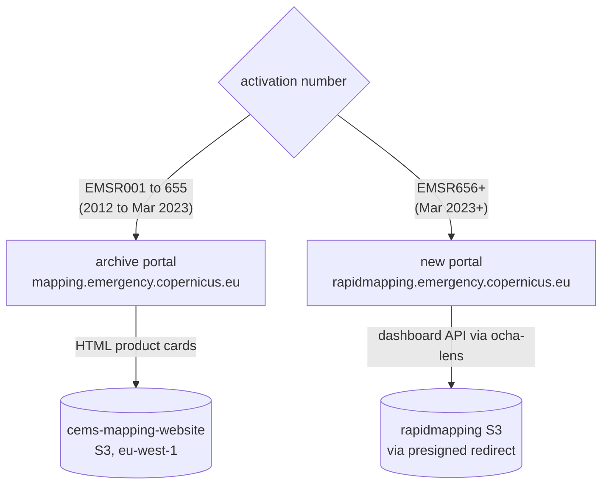

# CEMS flood archive: data acquisition and provenance

Where the data comes from, endpoint by endpoint, how it was transferred, and
how every transfer is verified and recorded. Companions:
[`README.md`](README.md) (operations) and
`exploratory/0005-cems-flood-feasibility/findings.md` (the source-mapping
evidence).

## The corpus

All vector delineation/damage packages published by **Copernicus EMS Rapid
Mapping** for **flood activations, 2012 to present**: 302 activations
(EMSR009 to EMSR927 at harvest time), archived byte identical to
`global/copernicus_ems/flood/bronze/` with a complete transfer ledger.

**Licence:** free re-use with attribution (© European Union, Copernicus
Emergency Management Service). Stamped on every transfer record.

## Sources

CEMS publishes through two generations of portal. Both are public HTTPS GET,
no authentication. The one requirement is a browser-like `User-Agent` (the
default `python-requests` UA gets HTTP 403 from the new backend).



### Archive portal (full history)

| Purpose | Endpoint | Interface |
|---|---|---|
| Activation inventory, all 1,060 CEMS activations 2012+ | `https://mapping.emergency.copernicus.eu/activations/api/activations/?format=json&limit=…&offset=…` | REST (Django REST Framework), paginated JSON |
| Product listing per legacy activation (EMSR001 to 655) | `https://mapping.emergency.copernicus.eu/activations/{EMSRnnn}/` | Server-rendered HTML; product cards parsed for AOI, title, delivery time, links |
| Legacy product files | `https://cems-mapping-website.s3.eu-west-1.amazonaws.com/static/activations/{EMSRnnn}/{filename}_vector.zip` | S3 GET, links taken verbatim from the page |

This inventory API is the authoritative activation list: it covers the full
history, including activations the newer portal does not serve. Floods are
selected on `category.slug == "flood"`. `EMSN*` codes (the Risk & Recovery
service) are out of scope.

### New portal, EMSR656+ (via [`ocha-lens`](https://github.com/OCHA-DAP/ocha-lens))

| Purpose | Endpoint | Interface |
|---|---|---|
| Activation list | `https://rapidmapping.emergency.copernicus.eu/backend/dashboard-api/public-activations-info/` | JSON, paginated |
| Activation detail: AOIs, products, per-image `acquisitionTime` | `https://rapidmapping.emergency.copernicus.eu/backend/dashboard-api/public-activations/?code={EMSRnnn}` | JSON |
| Product files | `https://rapidmapping.emergency.copernicus.eu/backend/{EMSRnnn}/AOI{nn}/{PRODUCT}/{file}.zip` | 302 to presigned `rapidmapping.s3.amazonaws.com` GET |

The portals overlap for EMSR656+. Discovery cross-validates them and fails
loudly on any disagreement (they agreed exactly at harvest time).

### Not used, on purpose

The decommissioned old portal (`emergency.copernicus.eu/mapping`, pages 404,
only Wayback captures remain); the new portal's per-layer vector-tile and COG
endpoints (map display formats, wrong tool for bulk vectors); map PDFs and
JPEGs; and Reference (pre-event) packages, which stay inventoried in the
ledger as `excluded_ref` but are not fetched.

## What was downloaded

Per activation: every **Delineation (DEL), First Estimate (FEP) and Grading
(GRA)** vector package, covering every AOI, monitoring iteration and version.
2,888 packages, ~20 GB, stored exactly as CEMS serves them. No re-compression,
no modification.

## Method

Two stages, ledger driven (diagrams in [`README.md`](README.md)):

1. **Discovery** enumerates every target into `products.parquet`, one row per
   package, **including rows for products that cannot be fetched**, each with
   an explicit reason. Re-running merges: outcomes survive, new targets are
   added, vanished targets are flagged and never deleted.
2. **Harvest** transfers each pending target: download, HTTP status check,
   zip integrity check, member inventory, sha256, chunked upload, post-upload
   size verification, journal record. A small thread pool (default 6) does
   the transfers; the blob store is the source of truth, so an interrupted
   run resumes exactly where it stopped, and blobs found without metadata are
   re-hashed from the blob copy. Corrupt copies get demoted and re-fetched.

Politeness: delayed serial crawl for discovery, bounded concurrency against
S3 for harvest, exponential backoff on HTTP 429/5xx.

## Verification artifacts

Everything sits beside the data in `bronze/_meta/`:

| File | Answers |
|---|---|
| `activations.parquet` | which flood activations exist (both portals, cross-validated) |
| `products.parquet` | per target: status, source URL, blob path, sha256, size, timestamps, error evidence |
| `zip_contents.parquet` | what is inside every archived zip (name, size, compressed size) |
| `transfers.jsonl` | every attempt ever made, success or failure, with provider and licence |

Failures are permanent ledger rows, retried only on request. Upstream defects
found during harvest, recorded with evidence: a handful of legacy activations
whose products never migrated to the archive portal, two archive S3 objects
that contain an HTML page instead of the advertised zip, and two new-portal
URLs that 404 despite being advertised by the portal's own manifest.

## Processing status

This is the **bronze** (raw archive) layer. The planned silver layer
(flood-extent extraction across the five CEMS naming eras, canonical schema,
imagery acquisition-datetime enrichment) is specified in
`exploratory/0005-cems-flood-feasibility/findings.md` and will be documented
when built.

## Reproduce or update

```sh
uv run --group etl --group api python pipelines/cems_flood/discovery.py   # refresh ledger
uv run --group etl --group api python pipelines/cems_flood/harvest.py     # transfer anything new
uv run --group etl --group api python pipelines/cems_flood/report.py      # regenerate status report
```
