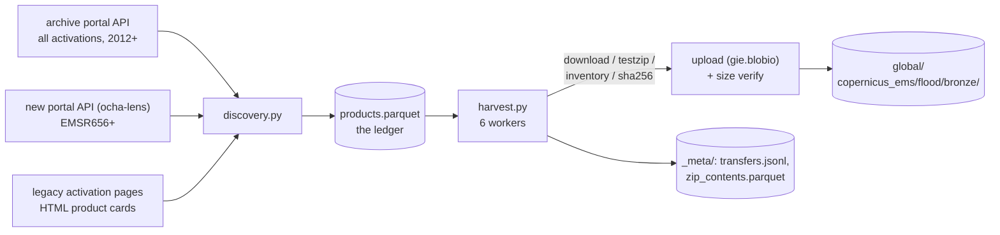

# CEMS flood historical archive harvester

Archives every Copernicus EMS Rapid Mapping flood vector package since 2012
(302 activations, ~2,900 zips, ~20 GB) to Azure blob, byte identical, with a
ledger that accounts for everything: what exists, what we archived, what
upstream lost, and what is inside every zip.

Endpoints and provenance: [ACQUISITION.md](ACQUISITION.md).
Evidence behind the design: `exploratory/0005-cems-flood-feasibility/`.

## How it works



```
bronze/
  code=EMSR009/ … code=EMSR927/   original basenames, one folder per activation
  _meta/                          ledger, zip inventory, journal, activations
```

Partitioning is flat on purpose. Legacy filenames span five naming
generations, so parsed metadata lives in the ledger where a wrong parse is a
one-line fix, not a blob migration.

## Status lifecycle

```mermaid
stateDiagram-v2
  [*] --> pending: discovery finds a download URL
  [*] --> excluded_ref: REF map, inventoried but not fetched
  [*] --> unavailable_x: upstream never published or lost it
  pending --> uploaded: transferred + verified
  pending --> failed_download: bad HTTP / bad zip
  pending --> failed_upload: transfer error
  failed_download --> pending: harvest.py &#45;&#45;retry&#45;failed
  failed_upload --> pending: harvest.py &#45;&#45;retry&#45;failed
  uploaded --> pending: blob copy corrupt, re queued
```



Scope: DEL, FEP and GRA vector packages, every AOI, monitoring and version.
Reference maps and map PDFs are inventoried but not fetched. A target we
cannot fetch keeps its ledger row and says why. Nothing is silently skipped.

## Run

```sh
uv run --group etl --group api python pipelines/cems_flood/discovery.py            # build/refresh ledger
uv run --group etl --group api python pipelines/cems_flood/harvest.py --dry-run    # preview
uv run --group etl --group api python pipelines/cems_flood/harvest.py              # transfer (resumable)
uv run --group etl --group api python pipelines/cems_flood/harvest.py --retry-failed
uv run --group etl --group api python pipelines/cems_flood/report.py --pages       # status page
```

Needs the repo `.env` (`DSCI_AZ_BLOB_*_SAS_WRITE` via `gie.config`). Default
stage is dev; `--stage prod` when promoting.

## Guarantees

- **Resume is exact.** The blob store is the source of truth (ADR-0005
  model): every run reconciles the ledger against a blob listing, skips what
  landed, demotes ledger rows whose blob is missing, and re-hashes blobs that
  lack metadata (corrupt copies get re queued). Kill it anytime; checkpoints
  run every 25 transfers and on exit.
- **Backfill is a re-run.** Fresh discovery merges onto the ledger: transfer
  outcomes survive, new products become pending, vanished targets are kept
  and flagged `missing_upstream`.
- **Every attempt is journaled.** `transfers.jsonl` records success and
  failure alike, with sha256, size, origin URL and licence, in the same shape
  as this repo's `data_transfers.jsonl`. Failures are retried only when you
  ask.

## Design calls

- Full zips, not selective range extraction: the corpus is small and upstream
  demonstrably loses history (7 legacy activations already gone).
- `ocha-stratus` for reads and listing; uploads through `gie.blobio` because
  the plain SDK single PUT path is the documented timeout failure on this
  lake (see `src/gie/blobio.py`; `ingest_cems.py` bypasses `to_blob` for the
  same reason).
- Workers do pure download and upload; the ledger, journal and checkpoints
  stay in the main thread. `--workers` is the politeness knob (12 caused
  upload timeouts on a home uplink, 6 is the default for a reason).
